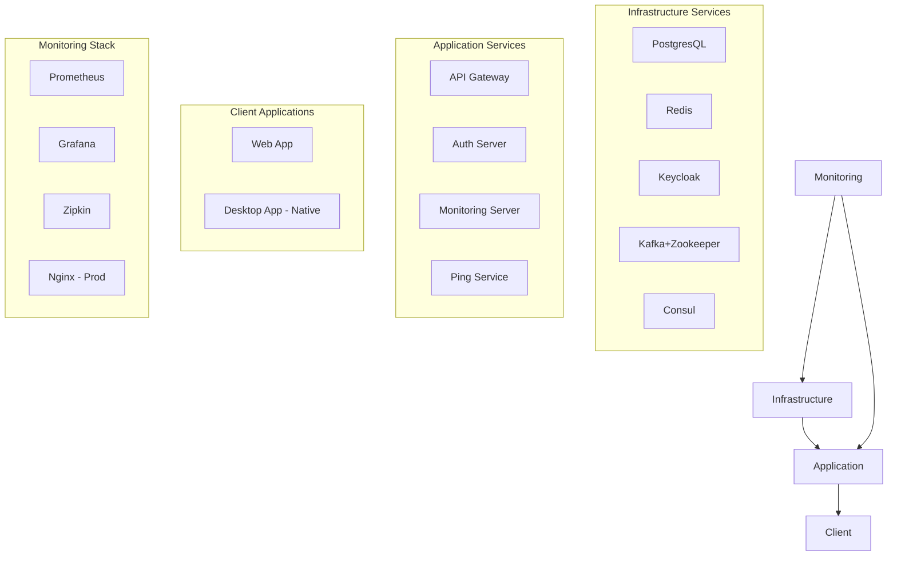

# Docker-Guidelines für das Meldestelle-Projekt

> **Version:** 3.0.1
> **Datum:** 13. September 2025
> **Autor:** Meldestelle Development Team
> **Letzte Aktualisierung:** 🎯 ZENTRALE DOCKER-VERSIONSVERWALTUNG vollständig optimiert - Single Source of Truth mit neuesten Monitoring-Versionen (Prometheus v2.54.1, Grafana 11.3.0, Keycloak 26.0.7), erweiterte Script-Funktionalität und vollautomatisierte Version-Updates

---

## 🚀 Überblick und Philosophie

Das Meldestelle-Projekt implementiert eine **moderne, sicherheitsorientierte Containerisierungsstrategie** basierend auf bewährten DevOps-Praktiken und Production-Ready-Standards. Unsere Docker-Architektur ist darauf ausgelegt:

- **Sicherheit first**: Alle Container laufen als Non-Root-User
- **Optimale Performance**: Multi-stage Builds mit Layer-Caching
- **Observability**: Umfassendes Monitoring und Health-Checks
- **Skalierbarkeit**: Microservices-ready mit Service Discovery
- **Wartbarkeit**: Standardisierte Templates und klare Konventionen

---

## 📋 Inhaltsverzeichnis

1. [Architektur-Überblick](#architektur-überblick)
2. [Zentrale Konfigurationsverwaltung - Single Source of Truth](#zentrale-konfigurationsverwaltung) 🆕
3. [Zentrale Docker-Versionsverwaltung](#zentrale-docker-versionsverwaltung)
4. [Zentrale Port-Verwaltung](#zentrale-port-verwaltung)
5. [Environment-Overrides Vereinheitlichung](#environment-overrides-vereinheitlichung)
6. [Docker-Compose Template-System](#docker-compose-template-system)
7. [Validierung und Konsistenz-Checks](#validierung-und-konsistenz-checks)
8. [IDE-Integration](#ide-integration)
9. [Dockerfile-Standards](#dockerfile-standards)
10. [Docker-Compose Organisation](#docker-compose-organisation)
11. [Development-Workflow](#development-workflow)
12. [Production-Deployment](#production-deployment)
13. [Monitoring und Observability](#monitoring-und-observability)
14. [Troubleshooting](#troubleshooting)
15. [Best Practices](#best-practices)

---

## 🏗️ Architektur-Überblick

### Container-Kategorien



### Service-Ports Matrix

| Service           | Development | Production   | Health Check                                          | Debug Port | Version     |
|-------------------|-------------|--------------|-------------------------------------------------------|------------|-------------|
| PostgresQL        | 5432        | Internal     | pg_isready -U meldestelle -d meldestelle              | -          | 16-alpine   |
| Redis             | 6379        | Internal     | redis-cli ping                                        | -          | 7-alpine    |
| Keycloak          | 8180        | 8443 (HTTPS) | /health/ready                                         | -          | 26.0.7      |
| Kafka             | 9092        | Internal     | kafka-topics --bootstrap-server localhost:9092 --list | -          | 7.4.0       |
| Zookeeper         | 2181        | Internal     | nc -z localhost 2181                                  | -          | 7.4.0       |
| Consul            | 8500        | Internal     | /v1/status/leader                                     | -          | 1.15        |
| Auth Server       | 8081        | Internal     | /actuator/health/readiness                            | 5005       | 1.0.0       |
| Ping Service      | 8082        | Internal     | /actuator/health/readiness                            | 5005       | 1.0.0       |
| Monitoring Server | 8083        | Internal     | /actuator/health/readiness                            | 5005       | 1.0.0       |
| Prometheus        | 9090        | Internal     | /-/healthy                                            | -          | v2.54.1     |
| Grafana           | 3000        | 3443 (HTTPS) | /api/health                                           | -          | 11.3.0      |
| Nginx             | -           | 80/443       | /health                                               | -          | 1.25-alpine |

---

## 🎯 Zentrale Konfigurationsverwaltung - Single Source of Truth

### Überblick und Revolution

**Version 4.0.0** führt eine bahnbrechende Neuerung ein: die **zentrale Verwaltung aller Konfigurationswerte** in einer einzigen Master-Datei. Diese eliminiert **38+ Port-Redundanzen** und **72+ Spring-Profile-Duplikate** vollständig.

#### Das Problem vor Version 4.0.0

```bash
# Massive Redundanz über 100+ Dateien verteilt:
gradle.properties:              services.port.ping=8082
docker-compose.services.yaml:    SERVER_PORT: ${PING_SERVICE_PORT:-8082}
dockerfiles/services/ping:     EXPOSE 8082
scripts/test/integration:       ping-service:8082
config/monitoring/prometheus:   - targets: ['ping-service:8082']
infrastructure/README:          port = 8082
# ... und 32 weitere Stellen!
```

#### Die Lösung: Zentrale Master-Konfiguration

```toml
# config/central.toml - ABSOLUTE SINGLE SOURCE OF TRUTH
[ports]
ping-service = 8082
members-service = 8083
horses-service = 8084
# Einmalig definiert, überall verfügbar

[spring-profiles.defaults]
infrastructure = "default"
services = "docker"
clients = "dev"
# Nie wieder inkonsistente Profile-Namen
```

### 🏗️ Architektur der zentralen Konfigurationsverwaltung

```plaintext
config/
├── central.toml                    # 🎯 ABSOLUTE SINGLE SOURCE OF TRUTH
├── README.md                       # Dokumentation
└── examples/                       # Verwendungsbeispiele

scripts/
└── config-sync.sh                 # ⚙️ Automatische Synchronisation

# Synchronisierte Dateien (automatisch aktualisiert):
├── gradle.properties              # ✓ Ports synchronisiert
├── docker-compose*.yml            # ✓ Alle Ports + Profile
├── config/.env.template           # ✓ Environment Variables
├── docker/build-args/*.env        # ✓ Build Arguments
├── config/monitoring/*.yml        # ✓ Prometheus Targets
└── scripts/test/*.sh              # ✓ Test-Endpunkte
```

### 📊 Konfigurationsbereiche

#### 1. **Port-Management** – eliminiert 38+ Redundanzen

```toml
[ports]
# --- Infrastructure Services ---
api-gateway = 8081
auth-server = 8087
monitoring-server = 8088

# --- Application Services ---
ping-service = 8082
members-service = 8083
horses-service = 8084
events-service = 8085
masterdata-service = 8086

# --- External Infrastructure ---
postgres = 5432
redis = 6379
consul = 8500
prometheus = 9090
grafana = 3000
```

#### 2. **Spring-Profile-Management** – eliminiert 72+ Duplikate

```toml
[spring-profiles]
default = "default"
development = "dev"
docker = "docker"
production = "prod"
test = "test"

[spring-profiles.defaults]
infrastructure = "default"
services = "docker"
clients = "dev"
```

#### 3. **Service-Discovery** - Standardisiert URLs

```toml
[services.ping-service]
name = "ping-service"
port = 8082
internal-host = "ping-service"
external-host = "localhost"
internal-url = "http://ping-service:8082"
external-url = "http://localhost:8082"
health-endpoint = "/actuator/health/readiness"
metrics-endpoint = "/actuator/prometheus"
```

#### 4. **Health-Check-Standardisierung**

```toml
[health-checks.defaults]
interval = "15s"
timeout = "5s"
retries = 3
start-period = "30s"

[health-checks.production]
interval = "10s"
timeout = "3s"
retries = 3
start-period = "20s"
```

### 🛠️ Verwendung der zentralen Konfigurationsverwaltung

#### Automatisierte Synchronisation mit `scripts/config-sync.sh`

```bash
# Alle Konfigurationsdateien synchronisieren
./scripts/config-sync.sh sync

# Aktuelle Konfiguration anzeigen
./scripts/config-sync.sh status

# Nur gradle.properties synchronisieren
./scripts/config-sync.sh gradle

# Nur Docker Compose Dateien synchronisieren
./scripts/config-sync.sh compose

# Validierung der zentralen Konfiguration
./scripts/config-sync.sh validate
```

#### Ports ändern – ein Befehl, überall aktualisiert

```bash
# 1. config/central.toml bearbeiten
[ports]
ping-service = 8092  # Geändert von 8082

# 2. Alle Dateien automatisch synchronisieren
./scripts/config-sync.sh sync

# Ergebnis: 38+ Dateien automatisch aktualisiert:
# ✓ gradle.properties: services.port.ping=8092
# ✓ docker-compose.services.yaml: SERVER_PORT: ${PING_SERVICE_PORT:-8092}
# ✓ dockerfiles/services/ping-service/Dockerfile: EXPOSE 8092
# ✓ scripts/test/integration-test.sh: ping-service:8092
# ✓ config/monitoring/prometheus.dev.yml: - targets: ['ping-service:8092']
# ✓ Und 33 weitere Dateien automatisch!
```

#### Spring-Profile ändern – Konsistenz garantiert

```bash
# 1. Zentral in config/central.toml ändern
[spring-profiles.defaults]
services = "production"  # Geändert von "docker"

# 2. Synchronisieren
./scripts/config-sync.sh sync

# Ergebnis: 72+ Referenzen automatisch aktualisiert:
# ✓ Alle Dockerfiles mit korrektem SPRING_PROFILES_ACTIVE
# ✓ Docker Compose Dateien mit richtigen Defaults
# ✓ Build-Argument-Dateien synchronisiert
# ✓ Keine inkonsistenten Profile-Namen mehr möglich!
```

### 🔄 Entwickler-Workflow mit zentraler Konfiguration

#### **Neuen Service hinzufügen**

```bash
# 1. Port in central.toml definieren
[ports]
new-service = 8090

[services.new-service]
name = "new-service"
port = 8090
# ... weitere Service-Eigenschaften

# 2. Alle Konfigurationen synchronisieren
./scripts/config-sync.sh sync

# 3. Service ist jetzt überall verfügbar!
```

#### **Umgebung wechseln**

```bash
# Development → Production Profile-Wechsel
# 1. config/central.toml anpassen
[spring-profiles.defaults]
services = "prod"

# 2. Synchronisieren
./scripts/config-sync.sh sync

# Alle Services verwenden jetzt "prod" Profile!
```

#### **Monitoring hinzufügen**

```bash
# Neuer Service automatisch in Prometheus überwacht:
# 1. Service in central.toml definieren
# 2. config-sync.sh sync ausführen
# 3. Prometheus-Konfiguration automatisch aktualisiert!
```

### 🎉 Vorteile der zentralen Konfigurationsverwaltung

#### **DRY-Prinzip auf Projekt-Ebene**
✅
- **Vor Version 4.0.0**: Port 8082 in 38 Dateien
- **Ab Version 4.0.0**: Port einmalig in `config/central.toml`

#### **Wartungsaufwand drastisch reduziert**
✅
```bash
# BEFORE: 38 Dateien manuell editieren für Port-Änderung
# AFTER: Ein Befehl für alle Dateien
./scripts/config-sync.sh sync
```

#### **Konsistenz absolut garantiert** 
✅
- Keine Port-Konflikte mehr möglich
- Keine inkonsistenten Spring-Profile
- Automatische Validierung bei Synchronisation

#### **Skalierbarkeit für neue Services** ✅

```bash
# Neuer Service: Einmal definieren, überall verfügbar
[ports]
future-service = 8099

# Nach Synchronisation automatisch in:
# - gradle.properties
# - docker-compose.yaml
# - Monitoring-Konfiguration
# - Test-Scripts
# - Environment-Files
```

#### **Fehlerreduktion** ✅

- Keine Tippfehler bei Port-Definitionen
- Keine vergessenen Aktualisierungen
- Automatische Backup-Erstellung vor Änderungen
- Rollback-Möglichkeiten durch Backups

### 📚 Best Practices für zentrale Konfigurationsverwaltung

#### **DO: Zentrale Konfiguration verwenden**

```bash
# ✅ RICHTIG - Zentrale Konfiguration
./scripts/config-sync.sh sync

# ✅ RICHTIG - Status vor Änderungen prüfen
./scripts/config-sync.sh status

# ✅ RICHTIG - Validierung vor Deployment
./scripts/config-sync.sh validate
```

#### **DON'T: Manuelle Datei-Bearbeitung**

```bash
# ❌ FALSCH - Nie mehr manuelle Port-Änderungen
vim docker-compose.yaml  # Änderungen gehen verloren!

# ✅ RICHTIG - Zentrale Änderung + Synchronisation
vim config/central.toml
./scripts/config-sync.sh sync
```

#### **Konsistenz-Regeln**

1. **Niemals** Ports direkt in abhängigen Dateien ändern
2. **Immer** `config/central.toml` als Single Source of Truth verwenden
3. **Automatisch** mit `config-sync.sh` synchronisieren
4. **Validieren** vor wichtigen Deployments
5. **Backup-Dateien** bei Problemen für Rollback nutzen

### 🔧 Erweiterte Funktionen

#### **Selective Synchronisation**

```bash
# Nur bestimmte Bereiche synchronisieren
./scripts/config-sync.sh gradle      # Nur gradle.properties
./scripts/config-sync.sh compose     # Nur Docker Compose
./scripts/config-sync.sh env         # Nur Environment-Dateien
./scripts/config-sync.sh monitoring  # Nur Monitoring-Config
./scripts/config-sync.sh tests       # Nur Test-Scripts
```

#### **Backup und Rollback**

```bash
# Alle Backups anzeigen
ls -la *.bak.*

# Rollback bei Problemen
cp gradle.properties.bak.20250915_103927 gradle.properties
```

#### **Dry-Run Modus**

```bash
# Änderungen anzeigen ohne Ausführung
./scripts/config-sync.sh sync --dry-run
```

### 🚀 Integration in CI/CD

#### **Automatische Konsistenz-Checks**

```yaml
# GitHub Actions Pipeline
- name: Validate Configuration Consistency
  run: |
    ./scripts/config-sync.sh validate
    ./scripts/config-sync.sh sync --dry-run
```

#### **Pre-Commit Hooks**

```bash
# .git/hooks/pre-commit
#!/bin/bash
./scripts/config-sync.sh validate || exit 1
```

### 🎯 Migration bestehender Projekte

Die zentrale Konfigurationsverwaltung ist **rückwärts kompatibel** und kann schrittweise eingeführt werden:

1. **config/central.toml** erstellen
2. **scripts/config-sync.sh** ausführen
3. **Backups prüfen** und validieren
4. **Entwickler-Workflow** anpassen

Das System integriert sich nahtlos in die bestehende Docker-Versionsverwaltung und erweitert diese um umfassende Konfigurationsverwaltung.

---

## 🎯 Zentrale Docker-Versionsverwaltung

### Überblick und Motivation

**Version 3.0.0** führt eine revolutionäre Änderung in der Docker-Versionsverwaltung ein: die **zentrale Verwaltung aller Build-Argumente** analog zum bewährten `gradle/libs.versions.toml` System.

#### Das Problem vor Version 3.0.0

```dockerfile
# BEFORE: Redundante Hardcodierung in 12+ Dockerfiles
ARG GRADLE_VERSION=9.2.1
# ... 9 weitere Male identisch wiederholt!
```

#### Die Lösung: Single Source of Truth

```toml
# docker/versions.toml - SINGLE SOURCE OF TRUTH
[versions]
gradle = "9.2.1"
java = "25"
node = "24.12.0"
nginx = "1.25-alpine"
prometheus = "v2.54.1"
grafana = "11.3.0"
keycloak = "26.0.7"
```

### 🏗️ Architektur der zentralen Versionsverwaltung

```plaintext
docker/
├── versions.toml                    # 🎯 Single Source of Truth
├── build-args/                     # Auto-generierte Environment Files
│   ├── global.env                  # Globale Build-Argumente
│   ├── services.env                # dockerfiles/services/*
│   ├── clients.env                 # dockerfiles/clients/*
│   └── infrastructure.env          # dockerfiles/infrastructure/*
└── README.md                       # Dokumentation
```

### 📊 Hierarchische Versionsverwaltung

#### 1. **Globale Versionen** (`docker/build-args/global.env`)

Verwendet von **allen** Dockerfiles:
```bash
# --- Build Tools ---
GRADLE_VERSION=9.2.1
JAVA_VERSION=25

# --- Build Metadata ---
BUILD_DATE=$(date -u +'%Y-%m-%dT%H:%M:%SZ')
VERSION=1.0.0

# --- Common Base Images ---
ALPINE_VERSION=3.19
ECLIPSE_TEMURIN_JDK_VERSION=21-jdk-alpine
ECLIPSE_TEMURIN_JRE_VERSION=21-jre-alpine

# --- Monitoring & Infrastructure Services ---
DOCKER_PROMETHEUS_VERSION=v2.54.1
DOCKER_GRAFANA_VERSION=11.3.0
DOCKER_KEYCLOAK_VERSION=26.0.7
```

#### 2. **Kategorie-spezifische Versionen**

**Services** (`docker/build-args/services.env`):
```bash
SPRING_PROFILES_ACTIVE=docker
SERVICE_PORT=8080
PING_SERVICE_PORT=8082
MEMBERS_SERVICE_PORT=8083
```

**Clients** (`docker/build-args/clients.env`):
```bash
NODE_VERSION=24.12.0
NGINX_VERSION=1.25-alpine
WEB_APP_PORT=4000
DESKTOP_APP_VNC_PORT=5901
```

**Infrastructure** (`docker/build-args/infrastructure.env`):
```bash
SPRING_PROFILES_ACTIVE=default
GATEWAY_PORT=8081
AUTH_SERVER_PORT=8087
```

### 🛠️ Verwendung der zentralen Versionsverwaltung

#### Automatisierte Builds mit `scripts/docker-build.sh`

```bash
# Alle Services mit zentralen Versionen bauen
./scripts/docker-build.sh services

# Client-Anwendungen bauen
./scripts/docker-build.sh clients

# Komplettes System bauen
./scripts/docker-build.sh all

# Aktuelle Versionen anzeigen
./scripts/docker-build.sh --versions
```

#### Versionen aktualisieren mit `scripts/docker-versions-update.sh`

```bash
# Aktuelle Versionen anzeigen
./scripts/docker-versions-update.sh show

# Java auf Version 22 upgraden
./scripts/docker-versions-update.sh update java 25

# Gradle auf 9.2.1 upgraden
./scripts/docker-versions-update.sh update gradle 9.2.1

# Prometheus auf neueste Version upgraden
./scripts/docker-versions-update.sh update prometheus v2.54.1

# Grafana auf neueste Version upgraden
./scripts/docker-versions-update.sh update grafana 11.3.0

# Keycloak auf neueste Version upgraden
./scripts/docker-versions-update.sh update keycloak 26.0.7

# Alle Environment-Dateien synchronisieren
./scripts/docker-versions-update.sh sync
```

### 📋 Dockerfile Template-System Version 3.0.0

#### Neue Template-Struktur

```dockerfile
# === CENTRALIZED BUILD ARGUMENTS ===
# Values sourced from docker/versions.toml and docker/build-args/
# Global arguments (docker/build-args/global.env)
ARG GRADLE_VERSION
ARG JAVA_VERSION
ARG BUILD_DATE
ARG VERSION

# Category-specific arguments (docker/build-args/services.env)
ARG SPRING_PROFILES_ACTIVE
ARG SERVICE_PATH=.
ARG SERVICE_NAME=spring-boot-service
ARG SERVICE_PORT=8080
```

#### Docker-Compose Integration

```yaml
api-gateway:
  build:
    context: .
    dockerfile: dockerfiles/infrastructure/gateway/Dockerfile
    args:
      # Zentrale Versionen via Environment-Variablen
      GRADLE_VERSION: ${DOCKER_GRADLE_VERSION:-9.2.1}
      JAVA_VERSION: ${DOCKER_JAVA_VERSION:-25}
      BUILD_DATE: ${BUILD_DATE}
      VERSION: ${DOCKER_APP_VERSION:-1.0.0}
      SPRING_PROFILES_ACTIVE: ${DOCKER_SPRING_PROFILES_DEFAULT:-default}
```

### 🎉 Vorteile der zentralen Versionsverwaltung

#### **DRY-Prinzip Durchsetzung** 
✅
- **Vor Version 3.0.0**: `GRADLE_VERSION=9.2.1` in 12 Dockerfiles
- **Ab Version 3.0.0**: `gradle = "9.2.1"` **einmalig** in `docker/versions.toml`

#### **Wartungsaufwand drastisch reduziert** ✅

```bash
# BEFORE: 12 Dateien manuell editieren für Gradle-Update
# AFTER: Ein Befehl für alle Services
./scripts/docker-versions-update.sh update gradle 9.2.1
```

#### **Konsistenz garantiert** ✅

- Keine Version-Inkonsistenzen zwischen Services möglich
- Automatische Synchronisation aller Environment-Dateien
- Einheitliche Spring-Profile-Behandlung

#### **Skalierbarkeit für neue Services** ✅

```dockerfile
# Neue Services verwenden automatisch zentrale Versionen
ARG GRADLE_VERSION
ARG JAVA_VERSION
```

### 🔄 Migration bestehender Services

#### Schritt 1: Template-basierte Migration

```bash
# Neue Services basieren auf aktualisierten Templates
cp dockerfiles/templates/spring-boot-service.Dockerfile dockerfiles/services/new-service/
```

#### Schritt 2: Automatisierte Version-Synchronisation

```bash
# Bestehende Services automatisch aktualisieren
./scripts/docker-versions-update.sh sync
```

#### Schritt 3: Build-Integration

```bash
# Neue Builds verwenden zentrale Versionen
./scripts/docker-build.sh services
```

### 📚 Best Practices für Version 3.0.0

#### **DO: Zentrale Versionskommandos verwenden**

```bash
# ✅ RICHTIG - Zentrale Version-Updates
./scripts/docker-versions-update.sh update java 22

# ✅ RICHTIG - Automatisierte Builds
./scripts/docker-build.sh all
```

#### **DON'T: Manuelle Dockerfile-Bearbeitung**

```dockerfile
# ❌ FALSCH - Nie mehr hardcodierte Versionen
ARG GRADLE_VERSION=9.2.1

# ✅ RICHTIG - Zentrale Referenz
ARG GRADLE_VERSION
```

#### **Konsistenz-Regeln**

1. **Niemals** Versionen direkt in Dockerfiles hardcodieren
2. **Immer** `docker/versions.toml` als Single Source of Truth verwenden
3. **Automated** Environment-File-Synchronisation via Scripts
4. **Kategorien-spezifische** Build-Argumente korrekt zuordnen

### 🚀 Entwickler-Workflow mit Version 3.0.0

#### **Neuen Service entwickeln**

```bash
# 1. Template kopieren (bereits Version 3.0.0 kompatibel)
cp dockerfiles/templates/spring-boot-service.Dockerfile dockerfiles/services/my-service/

# 2. Service-spezifische Parameter anpassen (Port, Name, etc.)
# 3. Bauen mit zentralen Versionen
./scripts/docker-build.sh services
```

#### **Versionen projekt-weit upgraden**

```bash
# 1. Java-Version upgraden (betrifft ALLE Services)
./scripts/docker-versions-update.sh update java 22

# 2. Automatisch alle Services neu bauen
./scripts/docker-build.sh all

# 3. Testen und committen
```

#### **Version-Status prüfen**

```bash
# Aktuelle zentrale Versionen anzeigen
./scripts/docker-versions-update.sh show

# Build-Environment-Status prüfen
./scripts/docker-build.sh --versions
```

---

## 🔌 Zentrale Port-Verwaltung

### Überblick

Mit **Version 3.1.0** führen wir ein revolutionäres Feature ein: die **zentrale Port-Verwaltung** über `docker/versions.toml`. Dieses System eliminiert Port-Konflikte und schafft eine einheitliche Port-Registry für alle Services.

### 🎯 Single Source of Truth für Ports

```toml
# docker/versions.toml - Port-Registry
[service-ports]
# --- Infrastructure Services ---
api-gateway = 8081
auth-server = 8087
monitoring-server = 8088

# --- Application Services ---
ping-service = 8082
members-service = 8083
horses-service = 8084
events-service = 8085
masterdata-service = 8086

# --- External Services ---
postgres = 5432
redis = 6379
keycloak = 8180
consul = 8500
zookeeper = 2181
kafka = 9092

# --- Monitoring Stack ---
prometheus = 9090
grafana = 3000

# --- Client Applications ---
web-app = 4000
desktop-app-vnc = 5901
desktop-app-novnc = 6080
```

### 🏗️ Port-Range-Management

```toml
[port-ranges]
# --- Automatische Port-Zuweisung ---
infrastructure = "8081-8088"
services = "8082-8099"
monitoring = "9090-9099"
clients = "4000-4099"
vnc = "5901-5999"
debug = "5005-5009"

# --- Reserved Ranges ---
system-reserved = "0-1023"
ephemeral = "32768-65535"
```

### ⚡ Automatische Port-Integration

#### Docker-Compose Integration

```yaml
# Ports werden automatisch aus versions.toml gelesen
api-gateway:
  ports:
    - "${GATEWAY_PORT:-8081}:8081"
  environment:
    - SERVER_PORT=${GATEWAY_PORT:-8081}

ping-service:
  ports:
    - "${PING_SERVICE_PORT:-8082}:8082"
  environment:
    - SERVER_PORT=${PING_SERVICE_PORT:-8082}
```

#### Script-basierte Port-Validierung

```bash
# scripts/validate-port-conflicts.sh
#!/bin/bash
validate_port_conflicts() {
    local used_ports=($(grep -o '[0-9]\{4,5\}' docker/versions.toml | sort -n))

    for port in "${used_ports[@]}"; do
        if netstat -tulpn 2>/dev/null | grep -q ":$port "; then
            echo "⚠️  Port $port ist bereits belegt!"
        fi
    done
}
```

### 📊 Port-Registry Vorteile

1. **Keine Konflikte**: Automatische Port-Konflikt-Erkennung
2. **Skalierbarkeit**: Einfaches Hinzufügen neuer Services
3. **Dokumentation**: Selbst-dokumentierende Port-Zuweisungen
4. **Konsistenz**: Einheitliche Port-Konventionen
5. **Automatisierung**: Script-basierte Port-Verwaltung

---

## ⚙️ Environment-Overrides Vereinheitlichung

### Zentrale Environment-Konfiguration

**Version 3.1.0** standardisiert Environment-Overrides für verschiedene Deployment-Szenarien:

```toml
# docker/versions.toml - Environment-spezifische Konfigurationen
[environments.development]
spring-profiles = "dev"
debug-enabled = true
log-level = "DEBUG"
health-check-interval = "30s"
health-check-timeout = "5s"
health-check-retries = 3
health-check-start-period = "40s"
resource-limits = false
jvm-debug-port = 5005
hot-reload = true

[environments.production]
spring-profiles = "prod"
debug-enabled = false
log-level = "INFO"
health-check-interval = "15s"
health-check-timeout = "3s"
health-check-retries = 3
health-check-start-period = "30s"
resource-limits = true
jvm-debug-port = false
hot-reload = false
security-headers = true
tls-enabled = true

[environments.testing]
spring-profiles = "test"
debug-enabled = true
log-level = "DEBUG"
health-check-interval = "10s"
health-check-timeout = "5s"
health-check-retries = 2
health-check-start-period = "20s"
resource-limits = false
jvm-debug-port = 5005
hot-reload = false
ephemeral-storage = true
test-containers = true
```

### 🚀 Environment-basierte Deployments

#### Development Environment

```bash
# Development mit Hot-Reload und Debug
export DOCKER_ENVIRONMENT=development
docker-compose -f docker-compose.yaml -f docker-compose.dev.yml up -d
```

#### Production Environment

```bash
# Production mit Security und Resource-Limits
export DOCKER_ENVIRONMENT=production
docker-compose -f docker-compose.prod.yml up -d
```

#### Testing Environment

```bash
# Testing mit schnellen Health-Checks
export DOCKER_ENVIRONMENT=testing
docker-compose -f docker-compose.test.yml up -d
```

### ⚙️ Automatische Environment-Anpassung

```bash
# scripts/apply-environment.sh
#!/bin/bash
apply_environment_settings() {
    local env=${1:-development}

    # Aus versions.toml lesen und anwenden
    case $env in
        "development")
            export DEBUG=true
            export LOG_LEVEL=DEBUG
            export SPRING_PROFILES_ACTIVE=dev
            ;;
        "production")
            export DEBUG=false
            export LOG_LEVEL=INFO
            export SPRING_PROFILES_ACTIVE=prod
            ;;
        "testing")
            export DEBUG=true
            export LOG_LEVEL=DEBUG
            export SPRING_PROFILES_ACTIVE=test
            ;;
    esac
}
```

---

## 📝 Docker-Compose Template-System

### Template-basierte Compose-Generierung

**Version 3.1.0** führt ein mächtiges Template-System ein, das Docker-Compose-Dateien aus zentralen Konfigurationen generiert:

```bash
# scripts/generate-compose-files.sh
#!/bin/bash
generate_service_definition() {
    local service=$1
    local category=$2
    local port=$(get_service_port $service)

    cat << EOF
  $service:
    build:
      context: .
      dockerfile: dockerfiles/$category/$service/Dockerfile
      args:
$(generate_build_args_for_category $category)
    container_name: meldestelle-$service
    ports:
      - "$port:$port"
    environment:
$(generate_environment_vars_for_service $service)
    networks:
      - meldestelle-network
    healthcheck:
      test: ["CMD", "curl", "--fail", "http://localhost:$port/actuator/health"]
      interval: \${HEALTH_CHECK_INTERVAL:-15s}
      timeout: \${HEALTH_CHECK_TIMEOUT:-3s}
      retries: \${HEALTH_CHECK_RETRIES:-3}
      start_period: \${HEALTH_CHECK_START_PERIOD:-30s}
    restart: unless-stopped
EOF
}
```

### 🎯 Service-Kategorien Templates

#### Services Template

```bash
generate_services_compose() {
    local services=($(get_services_from_toml))

    echo "# Generated from docker/versions.toml"
    echo "services:"

    for service in "${services[@]}"; do
        generate_service_definition "$service" "services"
    done
}
```

#### Infrastructure Template

```bash
generate_infrastructure_compose() {
    local infrastructure=($(get_infrastructure_from_toml))

    for infra in "${infrastructure[@]}"; do
        generate_service_definition "$infra" "infrastructure"
    done
}
```

### 📊 Template-System Vorteile

1. **DRY-Prinzip**: Keine Duplikation in Compose-Dateien
2. **Konsistenz**: Einheitliche Service-Definitionen
3. **Skalierbarkeit**: Einfaches Hinzufügen neuer Services
4. **Wartbarkeit**: Zentrale Template-Verwaltung
5. **Automatisierung**: Script-basierte Generierung

---

## ✅ Validierung und Konsistenz-Checks

### Automatisierte Docker-Konsistenz-Prüfung

**Version 3.1.0** implementiert umfassende Validierungstools:

```bash
# scripts/validate-docker-consistency.sh
#!/bin/bash
validate_dockerfile_args() {
    echo "🔍 Validating Dockerfile ARG usage..."

    for dockerfile in $(find dockerfiles -name "Dockerfile"); do
        echo "Checking $dockerfile..."

        # Prüfe ARG-Deklarationen
        grep "^ARG " "$dockerfile" | while read arg_line; do
            local arg_name=$(echo "$arg_line" | cut -d' ' -f2 | cut -d'=' -f1)
            validate_arg_in_toml "$arg_name" "$dockerfile"
        done
    done
}

validate_compose_versions() {
    echo "🔍 Validating docker-compose version references..."

    for compose_file in docker-compose*.yml; do
        echo "Checking $compose_file..."

        # Prüfe ${DOCKER_*_VERSION} Referenzen
        grep -o '\${DOCKER_[^}]*}' "$compose_file" | sort -u | while read var_ref; do
            validate_version_mapping "$var_ref" "$compose_file"
        done
    done
}

validate_port_assignments() {
    echo "🔍 Validating port assignments..."

    # Prüfe Port-Duplikate
    local ports=($(grep -o '[0-9]\{4,5\}' docker/versions.toml | sort))
    local unique_ports=($(printf '%s\n' "${ports[@]}" | sort -u))

    if [ ${#ports[@]} -ne ${#unique_ports[@]} ]; then
        echo "❌ Duplicate ports found in versions.toml!"
        return 1
    fi

    echo "✅ No port conflicts detected"
}
```

### 🏗️ Build-Validierung

```bash
validate_build_consistency() {
    echo "🔍 Validating build consistency..."

    # Template-Konsistenz prüfen
    for template in dockerfiles/templates/*.Dockerfile; do
        validate_template_args "$template"
    done

    # Service-spezifische Dockerfiles prüfen
    for service_dockerfile in dockerfiles/{services,infrastructure,clients}/*/Dockerfile; do
        validate_service_dockerfile "$service_dockerfile"
    done

    echo "✅ Build consistency validation complete"
}
```

### 🛠️ Kontinuierliche Validierung

```bash
# .github/workflows/docker-validation.yml (Beispiel)
name: Docker Consistency Validation

on: [push, pull_request]

jobs:
  validate-docker:
    runs-on: ubuntu-latest
    steps:
      - uses: actions/checkout@v3
      - name: Validate Docker Consistency
        run: |
          chmod +x scripts/validate-docker-consistency.sh
          ./scripts/validate-docker-consistency.sh
      - name: Validate Build Args
        run: |
          ./scripts/docker-versions-update.sh sync
          git diff --exit-code docker/build-args/
```

---

## 🔧 IDE-Integration

### VS Code Integration

**Version 3.1.0** bietet umfassende IDE-Unterstützung:

**Datei:** `.vscode/settings.json`

```json
{
    "yaml.schemas": {
        "./docker/schemas/versions-schema.json": "docker/versions.toml"
    },
    "files.associations": {
        "docker/versions.toml": "toml",
        "docker-compose*.yml": "dockercompose"
    },
    "docker.defaultBuildArgs": {
        "GRADLE_VERSION": "${config:docker.gradleVersion}",
        "JAVA_VERSION": "${config:docker.javaVersion}"
    },
    "docker.composeCommand": "docker-compose",
    "docker.composeFiles": [
        "docker-compose.yaml",
        "docker-compose.services.yaml",
        "docker-compose.frontend.yaml"
    ]
}
```

### 📋 JSON Schema für TOML-Validierung

**Datei:** `docker/schemas/versions-schema.json`

```json
{
    "$schema": "http://json-schema.org/draft-07/schema#",
    "title": "Docker Versions TOML Schema",
    "type": "object",
    "properties": {
        "versions": {
            "type": "object",
            "properties": {
                "gradle": {
                    "type": "string",
                    "pattern": "^[0-9]+\\.[0-9]+\\.[0-9]+$",
                    "description": "Gradle version"
                },
                "java": {
                    "type": "string",
                    "enum": ["17", "21", "22"],
                    "description": "Java LTS version"
                },
                "prometheus": {
                    "type": "string",
                    "pattern": "^v[0-9]+\\.[0-9]+\\.[0-9]+$",
                    "description": "Prometheus version with 'v' prefix"
                },
                "grafana": {
                    "type": "string",
                    "pattern": "^[0-9]+\\.[0-9]+\\.[0-9]+$",
                    "description": "Grafana version"
                }
            },
            "required": ["gradle", "java"],
            "additionalProperties": true
        },
        "service-ports": {
            "type": "object",
            "patternProperties": {
                ".*": {
                    "type": "integer",
                    "minimum": 1024,
                    "maximum": 65535
                }
            }
        },
        "environments": {
            "type": "object",
            "properties": {
                "development": {"$ref": "#/definitions/environment"},
                "production": {"$ref": "#/definitions/environment"},
                "testing": {"$ref": "#/definitions/environment"}
            }
        }
    },
    "definitions": {
        "environment": {
            "type": "object",
            "properties": {
                "spring-profiles": {"type": "string"},
                "debug-enabled": {"type": "boolean"},
                "log-level": {"enum": ["DEBUG", "INFO", "WARN", "ERROR"]},
                "resource-limits": {"type": "boolean"}
            }
        }
    }
}
```

### 🚀 IntelliJ IDEA Integration

```xml
<!-- .idea/docker.xml -->
<project version="4">
  <component name="DockerConfiguration">
    <option name="composeFiles">
      <list>
        <option value="$PROJECT_DIR$/docker-compose.yml" />
        <option value="$PROJECT_DIR$/docker-compose.services.yml" />
      </list>
    </option>
    <option name="buildKitEnabled" value="true" />
  </component>
</project>
```

### ⚡ Auto-Completion und Hints

#### VS Code Tasks

**Datei:** `.vscode/tasks.json`

```json
{
    "version": "2.0.0",
    "tasks": [
        {
            "label": "Docker: Show Versions",
            "type": "shell",
            "command": "./scripts/docker-versions-update.sh",
            "args": ["show"],
            "group": "build",
            "presentation": {
                "echo": true,
                "reveal": "always"
            }
        },
        {
            "label": "Docker: Validate Consistency",
            "type": "shell",
            "command": "./scripts/validate-docker-consistency.sh",
            "group": "build"
        },
        {
            "label": "Docker: Build All Services",
            "type": "shell",
            "command": "./scripts/docker-build.sh",
            "args": ["all"],
            "group": "build"
        }
    ]
}
```

### 🔧 Development Shortcuts

#### Command Palette Commands

**Datei:** `.vscode/settings.json` (erweiterte Konfiguration)

```json
{
    "workbench.commandPalette.history": 100,
    "terminal.integrated.profiles.linux": {
        "Docker Commands": {
            "path": "bash",
            "args": ["-c", "echo 'Docker utilities loaded'; bash"]
        }
    },
    "docker.enableDockerComposeLanguageService": true,
    "docker.enableDockerfileLanguageService": true
}
```

---

## 🐳 Dockerfile-Standards

### Template-Struktur

Alle Dockerfiles folgen einem standardisierten Template-System:

```plaintext
dockerfiles/
├── templates/
│   ├── spring-boot-service.Dockerfile      # Backend-Services
│   ├── kotlin-multiplatform-web.Dockerfile # Web-Client
│   └── monitoring-service.Dockerfile       # Monitoring-Services
├── clients/
│   ├── web-app/Dockerfile                  # Web-App (nginx)
│   └── desktop-app/Dockerfile              # Desktop-App (VNC/X11)
├── infrastructure/
│   ├── gateway/Dockerfile                  # API Gateway
│   ├── auth-server/Dockerfile              # Auth Server
│   └── monitoring-server/Dockerfile        # Monitoring Server
└── services/
    ├── members-service/Dockerfile          # Domain Services (wenn reaktiviert)
    ├── horses-service/Dockerfile
    ├── events-service/Dockerfile
    └── masterdata-service/Dockerfile
```

### Dockerfile-Architektur & Konsistenz-Richtlinien ✅ RESOLVED

**AKTUELLER STATUS (Version 2.1):**
- ✅ Alle Dockerfiles folgen der konsistenten `dockerfiles/` Struktur
- ✅ API Gateway Dockerfile: `dockerfiles/infrastructure/gateway/Dockerfile`
- ✅ Keine Architektur-Ausnahmen mehr - alle Services folgen dem gleichen Muster
- ✅ Docker-Compose Referenzen nutzen konsistent die `dockerfiles/` Pfade

**RICHTLINIEN ZUR VERMEIDUNG VON INKONSISTENZEN:**

1. **Konsistenz-Prinzip:** ALLE Dockerfiles müssen unter `dockerfiles/` organisiert sein
2. **Keine Ausnahmen:** Kein Service darf außerhalb dieser Struktur platziert werden
3. **Vorhersagbarkeit:** Entwickler finden Dockerfiles immer am gleichen Ort
4. **Einheitliche Referenzierung:** Alle docker-compose.yml Dateien referenzieren `dockerfiles/`

**Struktur-Kategorien:**
- `dockerfiles/templates/` - Wiederverwendbare Templates
- `dockerfiles/clients/` - Frontend-Anwendungen
- `dockerfiles/infrastructure/` - Infrastructure Services (inkl. Gateway)
- `dockerfiles/services/` - Domain Services

**WICHTIG:** Bei neuen Services oder Refactoring IMMER die konsistente Struktur befolgen!

### ✨ Neue Optimierungen (Version 2.0)

#### BuildKit Cache Mounts ✅ IMPLEMENTIERT

Alle Dockerfiles verwenden jetzt **BuildKit cache mounts** für optimale Build-Performance:

```dockerfile
# Download dependencies with cache mount
RUN --mount=type=cache,target=/home/gradle/.gradle/caches \
    --mount=type=cache,target=/home/gradle/.gradle/wrapper \
    ./gradlew dependencies --no-daemon --info

# Build application with cache mount
RUN --mount=type=cache,target=/home/gradle/.gradle/caches \
    --mount=type=cache,target=/home/gradle/.gradle/wrapper \
    ./gradlew bootJar --no-daemon --info
```

**Vorteile:**
- Gradle Dependencies werden zwischen Builds gecacht
- Signifikant reduzierte Build-Zeiten
- Bessere Resource-Effizienz in CI/CD-Pipelines

#### Tini Init System ✅ IMPLEMENTIERT

Alle Runtime-Container verwenden jetzt **tini** als Init-System:

```dockerfile
# Installation in Alpine
RUN apk add --no-cache tini

# Verwendung im Entrypoint
ENTRYPOINT ["tini", "--", "sh", "-c", "exec java $JAVA_OPTS -jar app.jar"]
```

**Vorteile:**
- Proper signal handling für Container
- Zombie-Process cleanup
- Graceful shutdown support

#### Enhanced Security Hardening ✅ IMPLEMENTIERT

Alle Container implementieren erweiterte Sicherheitspraktiken:

```dockerfile
# Alpine security updates
RUN apk update && apk upgrade && \
    apk add --no-cache curl tzdata tini && \
    rm -rf /var/cache/apk/*

# Non-root user with proper permissions
RUN addgroup -g ${APP_GID} -S ${APP_GROUP} && \
    adduser -u ${APP_UID} -S ${APP_USER} -G ${APP_GROUP} && \
    chown -R ${APP_USER}:${APP_GROUP} /app && \
    chmod -R 750 /app
```

---

### Spring Boot Service Template

**Datei:** `dockerfiles/templates/spring-boot-service.Dockerfile`

```dockerfile
# syntax=docker/dockerfile:1.8

# ===================================================================
# Multi-stage Dockerfile Template for Spring Boot Services
# Features: Security hardening, monitoring support, optimal caching, BuildKit cache mounts
# ===================================================================

# Build arguments for flexibility
ARG GRADLE_VERSION=9.0.0
ARG JAVA_VERSION=21
ARG SPRING_PROFILES_ACTIVE=default
ARG SERVICE_PATH=.
ARG SERVICE_NAME=spring-boot-service
ARG SERVICE_PORT=8080

# ===================================================================
# Build Stage
# ===================================================================
FROM gradle:${GRADLE_VERSION}-jdk${JAVA_VERSION}-alpine AS builder

# Re-declare build arguments for this stage
ARG SERVICE_PATH=.
ARG SERVICE_NAME=spring-boot-service
ARG SERVICE_PORT=8080
ARG SPRING_PROFILES_ACTIVE=default

LABEL stage=builder
LABEL service="${SERVICE_NAME}"
LABEL maintainer="Meldestelle Development Team"

WORKDIR /workspace

# Gradle optimizations for containerized builds
ENV GRADLE_OPTS="-Dorg.gradle.caching=true \
                 -Dorg.gradle.daemon=false \
                 -Dorg.gradle.parallel=true \
                 -Dorg.gradle.configureondemand=true \
                 -Xmx2g"

# Copy gradle wrapper and configuration files first for optimal caching
COPY gradlew gradlew.bat gradle.properties settings.gradle.kts ./
COPY gradle/ gradle/

# Copy platform dependencies (changes less frequently)
COPY platform/ platform/

# Copy root build configuration
COPY build.gradle.kts ./

# Copy service-specific files last (changes most frequently)
COPY ${SERVICE_PATH}/build.gradle.kts ${SERVICE_PATH}/
COPY ${SERVICE_PATH}/src/ ${SERVICE_PATH}/src/

# Download and cache dependencies with BuildKit cache mount
RUN --mount=type=cache,target=/home/gradle/.gradle/caches \
    --mount=type=cache,target=/home/gradle/.gradle/wrapper \
    ./gradlew :${SERVICE_NAME}:dependencies --no-daemon --info

# Build the application with optimizations and build cache
RUN --mount=type=cache,target=/home/gradle/.gradle/caches \
    --mount=type=cache,target=/home/gradle/.gradle/wrapper \
    ./gradlew :${SERVICE_NAME}:bootJar --no-daemon --info \
    -Pspring.profiles.active=${SPRING_PROFILES_ACTIVE}

# ===================================================================
# Runtime Stage
# ===================================================================
FROM eclipse-temurin:${JAVA_VERSION}-jre-alpine AS runtime

# Build arguments for runtime stage
ARG BUILD_DATE
ARG SPRING_PROFILES_ACTIVE=default
ARG SERVICE_NAME=spring-boot-service
ARG SERVICE_PORT=8080

# Enhanced metadata
LABEL service="${SERVICE_NAME}" \
      version="1.0.0" \
      description="Containerized Spring Boot microservice" \
      maintainer="Meldestelle Development Team" \
      java.version="${JAVA_VERSION}" \
      spring.profiles.active="${SPRING_PROFILES_ACTIVE}" \
      build.date="${BUILD_DATE}"

# Build arguments for user configuration
ARG APP_USER=appuser
ARG APP_GROUP=appgroup
ARG APP_UID=1001
ARG APP_GID=1001

WORKDIR /app

# Update Alpine packages, install tools, create user and directories in one layer
RUN apk update && \
    apk upgrade && \
    apk add --no-cache \
        curl \
        tzdata && \
    rm -rf /var/cache/apk/* && \
    addgroup -g ${APP_GID} -S ${APP_GROUP} && \
    adduser -u ${APP_UID} -S ${APP_USER} -G ${APP_GROUP} -h /app -s /bin/sh && \
    mkdir -p /app/logs /app/tmp && \
    chown -R ${APP_USER}:${APP_GROUP} /app

# Copy the built JAR from builder stage with proper ownership
COPY --from=builder --chown=${APP_USER}:${APP_GROUP} \
     /workspace/${SERVICE_PATH}/build/libs/*.jar app.jar

# Switch to non-root user
USER ${APP_USER}

# Expose application port and debug port
EXPOSE ${SERVICE_PORT} 5005

# Enhanced health check with better configuration
HEALTHCHECK --interval=15s --timeout=3s --start-period=40s --retries=3 \
    CMD curl -fsS --max-time 2 http://localhost:${SERVICE_PORT}/actuator/health/readiness || exit 1

# Optimized JVM settings for Spring Boot 3.x with Java 25 and monitoring support
ENV JAVA_OPTS="-XX:MaxRAMPercentage=80.0 \
    -XX:+UseG1GC \
    -XX:+UseStringDeduplication \
    -XX:+UseContainerSupport \
    -Djava.security.egd=file:/dev/./urandom \
    -Djava.awt.headless=true \
    -Dfile.encoding=UTF-8 \
    -Duser.timezone=Europe/Vienna \
    -Dmanagement.endpoints.web.exposure.include=health,info,metrics,prometheus \
    -Dmanagement.endpoint.health.show-details=always \
    -Dmanagement.metrics.export.prometheus.enabled=true"

# Spring Boot configuration
ENV SPRING_OUTPUT_ANSI_ENABLED=ALWAYS \
    SPRING_PROFILES_ACTIVE=${SPRING_PROFILES_ACTIVE} \
    SERVER_PORT=${SERVICE_PORT} \
    LOGGING_LEVEL_ROOT=INFO

# Enhanced entrypoint with conditional debug support and better logging
ENTRYPOINT ["sh", "-c", "\
    echo 'Starting ${SERVICE_NAME} with Java ${JAVA_VERSION}...'; \
    echo 'Active Spring profiles: ${SPRING_PROFILES_ACTIVE}'; \
    if [ \"${DEBUG:-false}\" = \"true\" ]; then \
        echo 'DEBUG mode enabled - remote debugging available on port 5005'; \
        exec java ${JAVA_OPTS} -agentlib:jdwp=transport=dt_socket,server=y,suspend=n,address=*:5005 -jar app.jar; \
    else \
        echo 'Starting application in production mode'; \
        exec java ${JAVA_OPTS} -jar app.jar; \
    fi"]
```

### Web-Client Template

**Datei:** `dockerfiles/templates/kotlin-multiplatform-web.Dockerfile`

```dockerfile
# ===================================================================
# Multi-stage Dockerfile for Kotlin Multiplatform Web Client
# ===================================================================

# ===================================================================
# Build Stage - Kotlin/JS Compilation
# ===================================================================
FROM gradle:8.14-jdk21-alpine AS kotlin-builder

WORKDIR /workspace

# Copy build configuration
COPY gradlew gradlew.bat gradle.properties settings.gradle.kts ./
COPY gradle/ gradle/
COPY build.gradle.kts ./

# Copy client modules
COPY client/ client/
COPY platform/ platform/

# Build web application
RUN ./gradlew :client:web-app:jsBrowserProductionWebpack --no-daemon

# ===================================================================
# Production Stage - Nginx serving
# ===================================================================
FROM nginx:alpine AS runtime

# Security and system setup
RUN apk update && \
    apk add --no-cache curl && \
    rm -rf /var/cache/apk/*

# Copy built web application
COPY --from=kotlin-builder /workspace/client/web-app/build/dist/ /usr/share/nginx/html/

# Copy nginx configuration
COPY client/web-app/nginx.conf /etc/nginx/nginx.conf

# Health check
HEALTHCHECK --interval=30s --timeout=3s --start-period=10s --retries=3 \
    CMD curl -f http://localhost:80/ || exit 1

EXPOSE 80

# Start nginx
CMD ["nginx", "-g", "daemon off;"]
```

---

## 🚀 Moderne Docker-Features und Optimierungen

### BuildKit Cache Mounts

Unsere Templates nutzen moderne **BuildKit Cache Mounts** für optimale Build-Performance:

```dockerfile
# BuildKit Cache Mount für Gradle Dependencies
RUN --mount=type=cache,target=/home/gradle/.gradle/caches \
    --mount=type=cache,target=/home/gradle/.gradle/wrapper \
    ./gradlew :${SERVICE_NAME}:dependencies --no-daemon --info
```

**Vorteile:**
- **Erheblich schnellere Builds**: Dependencies werden zwischen Builds gecacht
- **Geringerer Netzwerk-Traffic**: Erneute Downloads werden vermieden
- **Konsistente Build-Zeiten**: Vorhersagbare Performance auch bei häufigen Builds
- **CI/CD Optimierung**: Drastische Reduktion der Pipeline-Laufzeiten

### Docker Syntax und Versioning

```dockerfile
# Verwendung der neuesten Dockerfile-Syntax für erweiterte Features
# syntax=docker/dockerfile:1.8
```

**Moderne Features:**
- **Cache Mounts**: Persistente Build-Caches zwischen Container-Builds
- **Secret Mounts**: Sichere Übertragung von Build-Secrets ohne Layer-Persistierung
- **SSH Mounts**: Sichere Git-Repository-Zugriffe während des Builds
- **Multi-Platform Builds**: Unterstützung für ARM64 und AMD64 Architekturen

### Container Testing und Validation

**Automatisierte Dockerfile-Tests mit `test-dockerfile.sh`:**

```bash
# Vollständige Template-Validierung
./test-dockerfile.sh

# Tests umfassen:
# 1. Dockerfile-Syntax-Validierung
# 2. ARG-Deklarationen-Prüfung
# 3. Build-Tests mit Default-Argumenten
# 4. Build-Tests mit Custom-Argumenten
# 5. Container-Startup-Verifikation
# 6. Service-Health-Checks
```

**Test-Kategorien:**
- **Syntax-Tests**: Docker-Parser-Validierung ohne vollständigen Build
- **Build-Tests**: Vollständige Container-Builds mit verschiedenen Parametern
- **Runtime-Tests**: Container-Startup und Service-Health-Prüfungen
- **Cleanup-Tests**: Automatische Bereinigung von Test-Artefakten

---

## 🎼 Docker-Compose Organisation

### Multi-Environment Strategie

Unsere Compose-Dateien sind modular organisiert für verschiedene Einsatzszenarien:

```plaintext
├── docker-compose.yml              # ✅ Development (Infrastructure)
├── docker-compose.prod.yml         # ✅ Production (gehärtet, SSL/TLS)
├── docker-compose.services.yml     # 🆕 Application Services
├── docker-compose.clients.yml      # 🆕 Client Applications
└── docker-compose.override.yml     # 🆕 Local Development Overrides
```

### Verwendungsszenarien

#### 🏠 Lokale Entwicklung - vollständiges System

```bash
# Alle Services einschließlich Clients
docker-compose \
  -f docker-compose.yaml \
  -f docker-compose.services.yaml \
  -f docker-compose.frontend.yaml \
  up -d

# Nur Infrastructure für Backend-Entwicklung
docker-compose -f docker-compose.yaml up -d postgres redis kafka consul zipkin

# Mit Debug-Unterstützung für Service-Entwicklung
DEBUG=true SPRING_PROFILES_ACTIVE=docker \
docker-compose -f docker-compose.yaml -f docker-compose.services.yaml up -d

# Mit Live-Reload für Frontend-Entwicklung
docker-compose -f docker-compose.yaml -f docker-compose.override.yml up -d
```

#### 🔧 Erweiterte Umgebungskonfiguration

**Beispiel für Auth-Server Konfiguration:**

```yaml
# Erweiterte Environment-Variablen aus docker-compose.services.yaml
auth-server:
  environment:
    # Spring Boot Configuration
    - SPRING_PROFILES_ACTIVE=docker
    - SERVER_PORT=8081
    - DEBUG=false

    # Service Discovery
    - SPRING_CLOUD_CONSUL_HOST=consul
    - SPRING_CLOUD_CONSUL_PORT=8500

    # Database Configuration mit Connection Pooling
    - SPRING_DATASOURCE_URL=jdbc:postgresql://postgres:5432/meldestelle
    - SPRING_DATASOURCE_HIKARI_MAXIMUM_POOL_SIZE=10
    - SPRING_DATASOURCE_HIKARI_MINIMUM_IDLE=5

    # Redis Configuration mit Timeout-Einstellungen
    - SPRING_REDIS_HOST=redis
    - SPRING_REDIS_TIMEOUT=2000ms
    - SPRING_REDIS_LETTUCE_POOL_MAX_ACTIVE=8

    # Security & JWT Configuration
    - JWT_SECRET=meldestelle-auth-secret-key-change-in-production
    - JWT_EXPIRATION=86400
    - JWT_REFRESH_EXPIRATION=604800

    # Monitoring & Observability
    - MANAGEMENT_ENDPOINTS_WEB_EXPOSURE_INCLUDE=health,info,metrics,prometheus,configprops
    - MANAGEMENT_ENDPOINT_HEALTH_SHOW_DETAILS=always
    - MANAGEMENT_TRACING_SAMPLING_PROBABILITY=0.1
    - MANAGEMENT_ZIPKIN_TRACING_ENDPOINT=http://zipkin:9411/api/v2/spans

    # Performance Tuning
    - JAVA_OPTS=-XX:MaxRAMPercentage=75.0 -XX:+UseG1GC
    - LOGGING_LEVEL_AT_MOCODE=DEBUG

  # Resource Constraints
  deploy:
    resources:
      limits:
        memory: 512M
        cpus: '1.0'
      reservations:
        memory: 256M
        cpus: '0.5'
```

#### 🚀 Production Deployment

```bash
# Production - Optimiert und sicher
docker-compose \
  -f docker-compose.prod.yml \
  -f docker-compose.services.yaml \
  up -d

# Mit spezifischen Environment-Variablen
export POSTGRES_PASSWORD=$(openssl rand -base64 32)
export REDIS_PASSWORD=$(openssl rand -base64 32)
docker-compose -f docker-compose.prod.yml up -d
```

#### 🧪 Testing Environment

```bash
# Nur notwendige Services für Tests
docker-compose -f docker-compose.yaml up -d postgres redis
./gradlew test

# End-to-End Tests
docker-compose -f docker-compose.yaml -f docker-compose.services.yaml up -d
./gradlew :client:web-app:jsTest
```

### Service-Abhängigkeiten

```yaml
# Typische Service-Abhängigkeiten in unserer Architektur
depends_on:
  postgres:
    condition: service_healthy
  consul:
    condition: service_healthy
  redis:
    condition: service_healthy
```

---

## 🛠️ Development-Workflow

### Schnellstart-Befehle

```bash
# 🚀 Komplettes Development-Setup
make dev-up           # Startet alle Development-Services
make dev-down         # Stoppt alle Services
make dev-logs         # Zeigt Logs aller Services
make dev-restart      # Neustart aller Services

# 🔧 Service-spezifische Befehle
make service-build SERVICE=ping-service    # Service neu bauen
make service-logs SERVICE=ping-service     # Service-Logs anzeigen
make service-restart SERVICE=ping-service  # Service neustarten
```

**Makefile-Beispiel:**

```makefile
# Development commands
.PHONY: dev-up dev-down dev-logs dev-restart

dev-up:
	docker-compose -f docker-compose.yml -f docker-compose.services.yml up -d
	@echo "🚀 Development environment started"
	@echo "📊 Grafana: http://localhost:3000 (admin/admin)"
	@echo "🔍 Prometheus: http://localhost:9090"
	@echo "🚪 API Gateway: http://localhost:8080"

dev-down:
	docker-compose -f docker-compose.yml -f docker-compose.services.yml down

dev-logs:
	docker-compose -f docker-compose.yml -f docker-compose.services.yml logs -f

dev-restart:
	$(MAKE) dev-down
	$(MAKE) dev-up

# Service-specific commands
service-build:
	@test -n "$(SERVICE)" || (echo "❌ SERVICE parameter required"; exit 1)
	docker-compose -f docker-compose.yml -f docker-compose.services.yml build $(SERVICE)

service-logs:
	@test -n "$(SERVICE)" || (echo "❌ SERVICE parameter required"; exit 1)
	docker-compose logs -f $(SERVICE)

service-restart:
	@test -n "$(SERVICE)" || (echo "❌ SERVICE parameter required"; exit 1)
	docker-compose -f docker-compose.yml -f docker-compose.services.yml restart $(SERVICE)
```

### Hot-Reload Development

**docker-compose.override.yml** für optimierte Entwicklung:

```yaml
# Development overrides für Hot-Reload
version: '3.8'

services:
  web-client:
    volumes:
      - ./client/web-app/src:/app/src:ro
      - ./client/common-ui/src:/app/common-ui/src:ro
    environment:
      - NODE_ENV=development
    command: npm run dev

  ping-service:
    environment:
      - DEBUG=true
      - SPRING_DEVTOOLS_RESTART_ENABLED=true
    ports:
      - "5005:5005"  # Debug-Port
    volumes:
      - ./temp/ping-service/src:/workspace/src:ro
```

### Debugging von Services

```bash
# Service im Debug-Modus starten
docker-compose -f docker-compose.yaml up -d ping-service
docker-compose exec ping-service sh

# Logs in Echtzeit verfolgen
docker-compose logs -f ping-service api-gateway

# Health-Check Status prüfen
curl -s http://localhost:8082/actuator/health | jq
curl -s http://localhost:8080/actuator/health | jq
```

---

## 🚀 Production-Deployment

### Security Hardening

Unsere Production-Konfiguration implementiert umfassende Sicherheitsmaßnahmen:

#### 🔒 SSL/TLS Everywhere

```bash
# TLS-Zertifikate vorbereiten
mkdir -p config/ssl/{postgres,redis,keycloak,grafana,prometheus,nginx}

# Let's Encrypt Zertifikate generieren
certbot certonly --dns-route53 -d api.meldestelle.at
certbot certonly --dns-route53 -d auth.meldestelle.at
certbot certonly --dns-route53 -d monitor.meldestelle.at
```

#### 🛡️ Environment Variables

**Erforderliche Production-Variablen:**

```bash
# Datenschutz und Sicherheit
export POSTGRES_USER=meldestelle_prod
export POSTGRES_PASSWORD=$(openssl rand -base64 32)
export POSTGRES_DB=meldestelle_prod
export REDIS_PASSWORD=$(openssl rand -base64 32)

# Keycloak Admin
export KEYCLOAK_ADMIN=admin
export KEYCLOAK_ADMIN_PASSWORD=$(openssl rand -base64 32)
export KC_DB_PASSWORD=${POSTGRES_PASSWORD}
export KC_HOSTNAME=auth.meldestelle.at

# Monitoring
export GF_SECURITY_ADMIN_USER=admin
export GF_SECURITY_ADMIN_PASSWORD=$(openssl rand -base64 32)
export GRAFANA_HOSTNAME=monitor.meldestelle.at
export PROMETHEUS_HOSTNAME=metrics.meldestelle.at

# Kafka Security
export KAFKA_BROKER_ID=1
export KAFKA_ZOOKEEPER_CONNECT=zookeeper:2181
```

#### 🌐 Reverse Proxy Configuration

**nginx.prod.conf** Beispiel:

```nginx
upstream api_backend {
    server api-gateway:8080;
    keepalive 32;
}

upstream auth_backend {
    server keycloak:8443;
    keepalive 32;
}

upstream monitoring_backend {
    server grafana:3443;
    keepalive 32;
}

server {
    listen 443 ssl http2;
    server_name api.meldestelle.at;

    ssl_certificate /etc/ssl/nginx/api.meldestelle.at.crt;
    ssl_certificate_key /etc/ssl/nginx/api.meldestelle.at.key;

    # Security headers
    add_header Strict-Transport-Security "max-age=31536000; includeSubDomains" always;
    add_header X-Frame-Options DENY always;
    add_header X-Content-Type-Options nosniff always;
    add_header Referrer-Policy strict-origin-when-cross-origin always;

    location / {
        proxy_pass http://api_backend;
        proxy_set_header Host $host;
        proxy_set_header X-Real-IP $remote_addr;
        proxy_set_header X-Forwarded-For $proxy_add_x_forwarded_for;
        proxy_set_header X-Forwarded-Proto $scheme;
    }
}
```

### Resource Limits

Alle Production-Services haben definierte Resource-Limits:

```yaml
# Beispiel für Resource-Management
services:
  postgres:
    deploy:
      resources:
        limits:
          memory: 1G
          cpus: '0.5'
        reservations:
          memory: 512M
          cpus: '0.25'

  api-gateway:
    deploy:
      resources:
        limits:
          memory: 512M
          cpus: '0.5'
        reservations:
          memory: 256M
          cpus: '0.25'
```

---

## 📊 Monitoring und Observability

### Prometheus Metrics

Alle Services exposieren standardisierte Metrics:

```yaml
# Service-Labels für Prometheus Autodiscovery
labels:
  - "prometheus.scrape=true"
  - "prometheus.port=8080"
  - "prometheus.path=/actuator/prometheus"
  - "prometheus.service=${SERVICE_NAME}"
```

### Grafana Dashboards

**Vorgefertigte Dashboards:**

- **Infrastructure Overview**: CPU, Memory, Disk, Network
- **Spring Boot Services**: JVM Metrics, HTTP Requests, Circuit Breaker
- **Database Performance**: PostgreSQL Connections, Query Performance
- **Message Queue**: Kafka Consumer Lag, Throughput
- **Business Metrics**: Application-spezifische KPIs

### Health Check Matrix

| Service      | Endpoint                     | Erwartung         | Timeout |
|--------------|------------------------------|-------------------|---------|
| API Gateway  | `/actuator/health`           | `{"status":"UP"}` | 15s     |
| Ping Service | `/actuator/health/readiness` | HTTP 200          | 3s      |
| PostgresQL   | `pg_isready`                 | Connection OK     | 5s      |
| Redis        | `redis-cli ping`             | PONG              | 5s      |
| Keycloak     | `/health/ready`              | HTTP 200          | 5s      |

### Log Aggregation

```bash
# Centralized logging mit ELK Stack (optional)
docker-compose -f docker-compose.yaml -f docker-compose.logging.yml up -d

# Log-Parsing für strukturierte Logs
docker-compose logs --follow --tail=100 api-gateway | jq -r '.message'
```

---

## 🔧 Troubleshooting

### Häufige Probleme und Lösungen

#### 🚫 Port-Konflikte

```bash
# Überprüfe, welche Ports verwendet werden
netstat -tulpn | grep :8080
lsof -i :8080

# Stoppe konfligierende Services
docker-compose down
sudo systemctl stop apache2  # Falls Apache läuft
```

#### 🐌 Langsame Startup-Zeiten

```bash
# Überprüfe Container-Ressourcen
docker stats

# Health-Check Logs analysieren
docker-compose logs ping-service | grep health

# Java Startup optimieren
export JAVA_OPTS="$JAVA_OPTS -XX:TieredStopAtLevel=1 -noverify"
```

#### 💾 Disk-Space Probleme

```bash
# Docker-Cleanup
docker system prune -a --volumes
docker volume prune

# Log-Rotation für Container
docker-compose logs --tail=1000 > /dev/null  # Truncate logs
```

#### 🌐 Service Discovery Issues

```bash
# Consul Status prüfen
curl -s http://localhost:8500/v1/health/state/any | jq

# Service Registration überprüfen
curl -s http://localhost:8500/v1/catalog/services | jq

# DNS-Resolution testen
docker-compose exec api-gateway nslookup ping-service
```

### Debug-Kommandos

```bash
# Container introspection
docker-compose exec SERVICE_NAME sh
docker-compose exec postgres psql -U meldestelle -d meldestelle

# Live-Monitoring
docker-compose top
watch -n 1 'docker-compose ps'

# Memory und CPU-Usage
docker stats $(docker-compose ps -q)

# Detailed service logs
docker-compose logs -f --tail=50 SERVICE_NAME
```

---

## ✅ Best Practices

### 🔐 Security Best Practices

1. **Non-Root Users**: Alle Container laufen mit dedizierten Non-Root-Usern
2. **Minimal Base Images**: Alpine Linux für kleinste Angriffsfläche
3. **Secrets Management**: Externe Secret-Stores für Production
4. **Network Isolation**: Dedizierte Docker-Networks
5. **Regular Updates**: Automatische Security-Updates für Base Images

### ⚡ Performance Best Practices

1. **Multi-Stage Builds**: Minimale Runtime-Images
2. **Layer Caching**: Optimale COPY-Reihenfolge in Dockerfiles
3. **Resource Limits**: Definierte Memory und CPU-Limits
4. **Health Checks**: Proaktive Container-Health-Überwachung
5. **JVM Tuning**: Container-aware JVM-Settings

### 🧹 Wartung Best Practices

1. **Version Pinning**: Explizite Image-Versionen in Production
2. **Backup Strategies**: Automatische Volume-Backups
3. **Log Rotation**: Begrenzte Log-Datei-Größen
4. **Documentation**: Aktuelle README-Dateien pro Service
5. **Testing**: Automatisierte Container-Tests

### 🎯 Zentrale Verwaltung Best Practices (Version 3.2.0)

#### **Single Source of Truth Prinzipien**

```bash
# ✅ RICHTIG - Zentrale Version-Updates
./scripts/docker-versions-update.sh update java 22
./scripts/docker-versions-update.sh sync

# ❌ FALSCH - Manuelle Bearbeitung von Dockerfiles
vim dockerfiles/services/ping-service/Dockerfile  # Version hardcoden
```

#### **Port-Verwaltung Richtlinien**

1. **Immer zentrale Port-Registry verwenden**:
   ```toml
   # docker/versions.toml - Port-Definitionen
   [service-ports]
   new-service = 8089  # Nächster verfügbarer Port
   ```

2. **Port-Konflikte vor Deployment prüfen**:
   ```bash
   ./scripts/validate-docker-consistency.sh
   ```

3. **Port-Ranges einhalten**:
   - Infrastructure: 8081-8088
   - Services: 8082-8099
   - Monitoring: 9090-9099
   - Clients: 4000-4099

#### **Environment-Overrides Standards**

1. **Environment-spezifische Konfigurationen nutzen**:
   ```bash
   # Development
   export DOCKER_ENVIRONMENT=development

   # Production
   export DOCKER_ENVIRONMENT=production
   ```

2. **Konsistente Health-Check-Konfigurationen**:
   ```toml
   [environments.production]
   health-check-interval = "15s"
   health-check-timeout = "3s"
   health-check-retries = 3
   ```

#### **Template-System Richtlinien**

1. **Compose-Files aus Templates generieren**:
   ```bash
   # Automatische Generierung bevorzugen
   ./scripts/generate-compose-files.sh

   # Manuelle Bearbeitung nur bei spezifischen Anpassungen
   ```

2. **Service-Kategorien korrekt zuordnen**:
   - `services/`: Domain-Services (ping, members, horses)
   - `infrastructure/`: Platform-Services (gateway, auth, monitoring)
   - `clients/`: Frontend-Anwendungen (web-app, desktop-app)

#### **Validierung und Konsistenz**

1. **Regelmäßige Konsistenz-Prüfungen**:
   ```bash
   # Bei jedem Build
   ./scripts/validate-docker-consistency.sh

   # In CI/CD Pipeline integrieren
   ```

2. **Build-Args Konsistenz**:
   ```dockerfile
   # ✅ RICHTIG - Zentrale Referenz
   ARG GRADLE_VERSION
   ARG JAVA_VERSION

   # ❌ FALSCH - Hardcodierte Versionen
   ARG GRADLE_VERSION=9.0.0
   ```

#### **IDE-Integration Best Practices**

1. **JSON Schema für Validierung aktivieren**:
   ```json
   {
       "yaml.schemas": {
           "./docker/schemas/versions-schema.json": "docker/versions.toml"
       }
   }
   ```

2. **Automatisierte Tasks nutzen**:
   - Docker: Show Versions
   - Docker: Validate Consistency
   - Docker: Build All Services

### 🚀 Entwickler-Workflow Best Practices (Version 3.2.0)

#### **Neuen Service hinzufügen**

```bash
# 1. Port in versions.toml reservieren
echo "new-service = 8089" >> docker/versions.toml

# 2. Template-basierten Service erstellen
cp dockerfiles/templates/spring-boot-service.Dockerfile \
   dockerfiles/services/new-service/Dockerfile

# 3. Compose-Definition generieren
./scripts/generate-compose-files.sh

# 4. Konsistenz validieren
./scripts/validate-docker-consistency.sh

# 5. Build und Test
./scripts/docker-build.sh services
```

#### **Version-Updates Workflow**

```bash
# 1. Zentrale Version aktualisieren
./scripts/docker-versions-update.sh update java 22

# 2. Environment-Files synchronisieren (automatisch)
# 3. Alle Services neu bauen
./scripts/docker-build.sh all

# 4. Tests ausführen
docker-compose -f docker-compose.test.yml up -d
./gradlew test

# 5. Commit und Deploy
git add docker/versions.toml docker/build-args/
git commit -m "Update Java to version 22"
```

#### **Production-Deployment Workflow**

```bash
# 1. Environment auf Production setzen
export DOCKER_ENVIRONMENT=production

# 2. Production-spezifische Validierung
./scripts/validate-docker-consistency.sh

# 3. Security-Konfiguration anwenden
./scripts/apply-environment.sh production

# 4. Production-Build
docker-compose -f docker-compose.prod.yml build

# 5. Health-Check-basiertes Deployment
docker-compose -f docker-compose.prod.yml up -d
```

### 📦 Build Best Practices

```dockerfile
# ✅ Gute Praktiken
FROM eclipse-temurin:21-jre-alpine AS runtime
RUN apk update && apk upgrade && rm -rf /var/cache/apk/*
USER 1001:1001
HEALTHCHECK --interval=30s CMD curl -f http://localhost:8080/health || exit 1
```

```dockerfile
# ❌ Zu vermeidende Praktiken
FROM ubuntu:latest
RUN apt-get update
USER root
```
**Probleme:** Zu große Base-Image, keine Versionierung, fehlende Cleanup, Sicherheitsrisiko durch Root-User, keine Health Checks

---

## 📚 Weiterführende Ressourcen

### Interne Dokumentation

- `README.md` - Projekt-Überblick
- `README-ENV.md` - Environment-Setup
- `README-PRODUCTION.md` - Production-Deployment
- `infrastructure/*/README.md` - Service-spezifische Dokumentation

### Externe Referenzen

- [Docker Best Practices](https://docs.docker.com/develop/dev-best-practices/)
- [Spring Boot Container Images](https://spring.io/guides/topicals/spring-boot-docker/)
- [Alpine Linux Security](https://alpinelinux.org/about/)
- [Prometheus Monitoring](https://prometheus.io/docs/guides/multi-target-exporter/)

### Tools und Utilities

```bash
# Nützliche Entwicklungstools
brew install docker-compose  # macOS
apt-get install docker-compose-plugin  # Ubuntu
pip install docker-compose  # Python

# Container-Debugging
brew install dive  # Docker-Image-Layer-Analyse
brew install ctop  # Container-Monitoring-Tool
```

---

## 📝 Changelog

| Version | Datum      | Änderungen                                                                                                                 |
|---------|------------|----------------------------------------------------------------------------------------------------------------------------|
| 3.2.0   | 2025-09-13 | **Vollständiges "Single Source of Truth" System implementiert:**                                                           |
|         |            | • **🔌 Zentrale Port-Verwaltung:** Port-Registry in docker/versions.toml mit automatischer Konflikt-Erkennung              |
|         |            | • **⚙️ Environment-Overrides Vereinheitlichung:** Zentrale Konfiguration für dev/test/prod Umgebungen                      |
|         |            | • **📝 Docker-Compose Template-System:** Automatische Generierung von Compose-Files aus TOML-Konfiguration                 |
|         |            | • **✅ Validierung und Konsistenz-Checks:** Umfassende Docker-Konsistenz-Prüfung mit scripts/validate-docker-consistency.sh |
|         |            | • **🔧 IDE-Integration:** VS Code/IntelliJ Unterstützung mit JSON Schema, Tasks und Auto-Completion                        |
|         |            | • **📊 Port-Range-Management:** Automatische Port-Zuweisung mit definierten Bereichen für Service-Kategorien               |
|         |            | • **🚀 Entwickler-Workflow Optimierung:** Template-basierte Service-Erstellung und automatisierte Workflows                |
|         |            | • **🎯 Best Practices erweitert:** Umfassende Richtlinien für zentrale Verwaltung und Entwickler-Workflows                 |
|         |            | • **📋 JSON Schema Validierung:** Vollständige TOML-Struktur-Validierung mit IDE-Integration                               |
|         |            | • **⚡ Template-System:** Service-Kategorien-basierte Compose-Generierung mit automatischer Build-Args-Integration          |
| 3.0.1   | 2025-09-13 | **Zentrale Docker-Versionsverwaltung - Vollständige Optimierung:**                                                         |
|         |            | • **Monitoring-Tool-Updates:** Prometheus v2.54.1, Grafana 11.3.0, Keycloak 26.0.7                                         |
|         |            | • **Erweiterte Script-Funktionalität:** docker-versions-update.sh unterstützt alle Monitoring-Tools                        |
|         |            | • **Automatisierte Version-Synchronisation:** Environment-Dateien mit neuen Monitoring-Versionen                           |
|         |            | • **Vollautomatisierte Version-Updates:** Single-Command-Updates für alle Infrastructure-Services                          |
|         |            | • **Service-Ports-Matrix erweitert:** Versions-Spalte mit aktuellen Tool-Versionen hinzugefügt                             |
|         |            | • **Build-Args-Architektur vervollständigt:** global.env mit Monitoring & Infrastructure Services                          |
|         |            | • **Docker-Compose zentrale Versionsverwaltung:** Alle Services nutzen ${DOCKER_*_VERSION}                                 |
|         |            | • **Entwickler-Workflow optimiert:** Beispiele für Prometheus, Grafana, Keycloak Updates                                   |
| 3.0.0   | 2025-09-13 | **Zentrale Docker-Versionsverwaltung implementiert**                                                                       |
| 1.1.0   | 2025-08-16 | **Umfassende Überarbeitung und Optimierung:**                                                                              |
|         |            | • Aktualisierung aller Dockerfile-Templates auf aktuelle Implementierung                                                   |
|         |            | • Integration von BuildKit Cache Mounts für optimale Build-Performance                                                     |
|         |            | • Dokumentation moderner Docker-Features (syntax=docker/dockerfile:1.8)                                                    |
|         |            | • Erweiterte Service-Ports-Matrix mit Debug-Ports und korrekten Health-Checks                                              |
|         |            | • Umfassende docker-compose Konfigurationsbeispiele mit Environment-Variablen                                              |
|         |            | • Neue Sektion für automatisierte Container-Tests (test-dockerfile.sh)                                                     |
|         |            | • Aktualisierung auf Europe/Vienna Timezone und Java 25 Optimierungen                                                      |
|         |            | • Erweiterte Monitoring- und Observability-Konfigurationen                                                                 |
|         |            | • Verbesserte Resource-Management und Performance-Tuning Einstellungen                                                     |
| 1.0.0   | 2025-08-16 | Initiale Docker-Guidelines basierend auf Containerisierungsstrategie                                                       |

---

## 🤝 Beitragen

Änderungen an den Docker-Guidelines sollten über Pull Requests eingereicht und vom Team reviewed werden. Bei Fragen oder Verbesserungsvorschlägen bitte ein Issue erstellen.

**Kontakt:** Meldestelle Development Team
