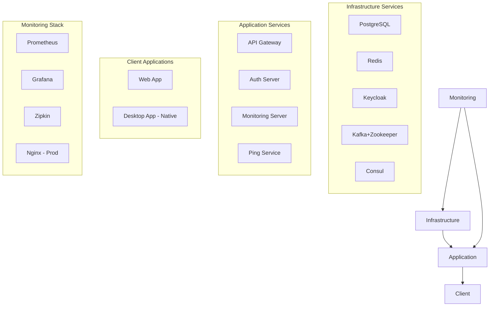

# Docker-Guidelines für das Meldestelle-Projekt

> **Version:** 1.0
> **Datum:** 16. August 2025
> **Autor:** Meldestelle Development Team

---

## 🚀 Überblick und Philosophie

Das Meldestelle-Projekt implementiert eine **moderne, sicherheitsorientierte Containerisierungsstrategie** basierend auf bewährten DevOps-Praktiken und Production-Ready-Standards. Unsere Docker-Architektur ist darauf ausgelegt:

- **Sicherheit first**: Alle Container laufen als Non-Root-User
- **Optimale Performance**: Multi-stage Builds mit Layer-Caching
- **Observability**: Umfassendes Monitoring und Health-Checks
- **Skalierbarkeit**: Microservices-ready mit Service Discovery
- **Wartbarkeit**: Standardisierte Templates und klare Konventionen

---

## 📋 Inhaltsverzeichnis

1. [Architektur-Überblick](#architektur-überblick)
2. [Dockerfile-Standards](#dockerfile-standards)
3. [Docker-Compose Organisation](#docker-compose-organisation)
4. [Development-Workflow](#development-workflow)
5. [Production-Deployment](#production-deployment)
6. [Monitoring und Observability](#monitoring-und-observability)
7. [Troubleshooting](#troubleshooting)
8. [Best Practices](#best-practices)

---

## 🏗️ Architektur-Überblick

### Container-Kategorien



### Service-Ports Matrix

| Service | Development | Production | Health Check |
|---------|------------|------------|--------------|
| PostgreSQL | 5432 | Internal | :5432 |
| Redis | 6379 | Internal | :6379 |
| Keycloak | 8180 | 8443 (HTTPS) | /health/ready |
| Kafka | 9092 | Internal | broker list |
| API Gateway | 8080 | Internal | /actuator/health |
| Ping Service | 8082 | Internal | /ping |
| Prometheus | 9090 | Internal | /-/healthy |
| Grafana | 3000 | 3443 (HTTPS) | /api/health |
| Nginx | - | 80/443 | /health |

---

## 🐳 Dockerfile-Standards

### Template-Struktur

Alle Dockerfiles folgen einem standardisierten Template-System:

```
dockerfiles/
├── templates/
│   ├── spring-boot-service.Dockerfile     # Backend-Services
│   ├── kotlin-multiplatform-web.Dockerfile # Web-Client
│   └── monitoring-service.Dockerfile       # Monitoring-Services
├── infrastructure/
│   ├── gateway/Dockerfile                  # ✅ API Gateway
│   ├── auth-server/Dockerfile             # Auth Server
│   └── monitoring-server/Dockerfile       # Monitoring Server
└── services/
    ├── members-service/Dockerfile         # Domain Services (wenn reaktiviert)
    ├── horses-service/Dockerfile
    ├── events-service/Dockerfile
    └── masterdata-service/Dockerfile
```

### Spring Boot Service Template

**Datei:** `dockerfiles/templates/spring-boot-service.Dockerfile`

```dockerfile
# syntax=docker/dockerfile:1.7

# ===================================================================
# Multi-stage Dockerfile Template for Spring Boot Services
# Features: Security hardening, monitoring support, optimal caching
# ===================================================================

# Build arguments
ARG GRADLE_VERSION=8.14
ARG JAVA_VERSION=21
ARG ALPINE_VERSION=3.19
ARG SPRING_PROFILES_ACTIVE=default

# ===================================================================
# Build Stage
# ===================================================================
FROM gradle:${GRADLE_VERSION}-jdk${JAVA_VERSION}-alpine AS builder

LABEL stage=builder
LABEL maintainer="Meldestelle Development Team"

WORKDIR /workspace

# Gradle optimizations
ENV GRADLE_OPTS="-Dorg.gradle.caching=true \
                 -Dorg.gradle.daemon=false \
                 -Dorg.gradle.parallel=true \
                 -Dorg.gradle.configureondemand=true \
                 -Xmx2g"

# Copy build files in optimal order for caching
COPY ../../gradlew gradlew.bat gradle.properties settings.gradle.kts ./
COPY ../../gradle gradle/
COPY ../../platform platform/
COPY ../../build.gradle.kts ./

# Copy service-specific files (replace SERVICE_PATH with actual path)
COPY ${SERVICE_PATH}/build.gradle.kts ${SERVICE_PATH}/
COPY ${SERVICE_PATH}/src/ ${SERVICE_PATH}/src/

# Build application
RUN ./gradlew :${SERVICE_NAME}:dependencies --no-daemon --info
RUN ./gradlew :${SERVICE_NAME}:bootJar --no-daemon --info \
    -Pspring.profiles.active=${SPRING_PROFILES_ACTIVE}

# ===================================================================
# Runtime Stage
# ===================================================================
FROM eclipse-temurin:${JAVA_VERSION}-jre-alpine AS runtime

# Metadata
LABEL service="${SERVICE_NAME}" \
      version="1.0.0" \
      maintainer="Meldestelle Development Team" \
      java.version="${JAVA_VERSION}"

# Build arguments
ARG APP_USER=appuser
ARG APP_GROUP=appgroup
ARG APP_UID=1001
ARG APP_GID=1001

WORKDIR /app

# System setup
RUN apk update && \
    apk upgrade && \
    apk add --no-cache curl jq tzdata && \
    rm -rf /var/cache/apk/*

# Non-root user creation
RUN addgroup -g ${APP_GID} -S ${APP_GROUP} && \
    adduser -u ${APP_UID} -S ${APP_USER} -G ${APP_GROUP} -h /app -s /bin/sh

# Directory setup
RUN mkdir -p /app/logs /app/tmp && \
    chown -R ${APP_USER}:${APP_GROUP} /app

# Copy JAR
COPY --from=builder --chown=${APP_USER}:${APP_GROUP} \
     /workspace/${SERVICE_PATH}/build/libs/*.jar app.jar

USER ${APP_USER}

# Expose ports
EXPOSE ${SERVICE_PORT} 5005

# Health check
HEALTHCHECK --interval=15s --timeout=3s --start-period=40s --retries=3 \
    CMD curl -fsS --max-time 2 http://localhost:${SERVICE_PORT}/actuator/health/readiness || exit 1

# JVM configuration
ENV JAVA_OPTS="-XX:MaxRAMPercentage=80.0 \
    -XX:+UseG1GC \
    -XX:+UseStringDeduplication \
    -XX:+UseContainerSupport \
    -Djava.security.egd=file:/dev/./urandom \
    -Djava.awt.headless=true \
    -Dfile.encoding=UTF-8 \
    -Duser.timezone=UTC \
    -Dmanagement.endpoints.web.exposure.include=health,info,metrics,prometheus"

# Spring Boot configuration
ENV SPRING_OUTPUT_ANSI_ENABLED=ALWAYS \
    SPRING_PROFILES_ACTIVE=${SPRING_PROFILES_ACTIVE} \
    SERVER_PORT=${SERVICE_PORT} \
    LOGGING_LEVEL_ROOT=INFO

# Startup command with debug support
ENTRYPOINT ["sh", "-c", "\
    if [ \"${DEBUG:-false}\" = \"true\" ]; then \
        echo 'Starting ${SERVICE_NAME} in DEBUG mode on port 5005...'; \
        exec java $JAVA_OPTS -agentlib:jdwp=transport=dt_socket,server=y,suspend=n,address=*:5005 -jar app.jar; \
    else \
        exec java $JAVA_OPTS -jar app.jar; \
    fi"]
```

### Web-Client Template

**Datei:** `dockerfiles/templates/kotlin-multiplatform-web.Dockerfile`

```dockerfile
# ===================================================================
# Multi-stage Dockerfile for Kotlin Multiplatform Web Client
# ===================================================================

# ===================================================================
# Build Stage - Kotlin/JS Compilation
# ===================================================================
FROM gradle:8.14-jdk21-alpine AS kotlin-builder

WORKDIR /workspace

# Copy build configuration
COPY gradlew gradlew.bat gradle.properties settings.gradle.kts ./
COPY gradle/ gradle/
COPY build.gradle.kts ./

# Copy client modules
COPY client/ client/
COPY platform/ platform/

# Build web application
RUN ./gradlew :client:web-app:jsBrowserProductionWebpack --no-daemon

# ===================================================================
# Production Stage - Nginx serving
# ===================================================================
FROM nginx:alpine AS runtime

# Security and system setup
RUN apk update && \
    apk add --no-cache curl && \
    rm -rf /var/cache/apk/*

# Copy built web application
COPY --from=kotlin-builder /workspace/client/web-app/build/dist/ /usr/share/nginx/html/

# Copy nginx configuration
COPY client/web-app/nginx.conf /etc/nginx/nginx.conf

# Health check
HEALTHCHECK --interval=30s --timeout=3s --start-period=10s --retries=3 \
    CMD curl -f http://localhost:80/ || exit 1

EXPOSE 80

# Start nginx
CMD ["nginx", "-g", "daemon off;"]
```

---

## 🎼 Docker-Compose Organisation

### Multi-Environment Strategie

Unsere Compose-Dateien sind modular organisiert für verschiedene Einsatzszenarien:

```
├── docker-compose.yml              # ✅ Development (Infrastructure)
├── docker-compose.prod.yml         # ✅ Production (gehärtet, SSL/TLS)
├── docker-compose.services.yml     # 🆕 Application Services
├── docker-compose.clients.yml      # 🆕 Client Applications
└── docker-compose.override.yml     # 🆕 Local Development Overrides
```

### Verwendungsszenarien

#### 🏠 Lokale Entwicklung - Vollständiges System

```bash
# Alle Services einschließlich Clients
docker-compose \
  -f docker-compose.yml \
  -f docker-compose.services.yml \
  -f docker-compose.clients.yml \
  up -d

# Nur Infrastructure für Backend-Entwicklung
docker-compose -f docker-compose.yml up -d postgres redis kafka consul

# Mit Live-Reload für Frontend-Entwicklung
docker-compose -f docker-compose.yml -f docker-compose.override.yml up -d
```

#### 🚀 Production Deployment

```bash
# Production - Optimiert und sicher
docker-compose \
  -f docker-compose.prod.yml \
  -f docker-compose.services.yml \
  up -d

# Mit spezifischen Environment-Variablen
export POSTGRES_PASSWORD=$(openssl rand -base64 32)
export REDIS_PASSWORD=$(openssl rand -base64 32)
docker-compose -f docker-compose.prod.yml up -d
```

#### 🧪 Testing Environment

```bash
# Nur notwendige Services für Tests
docker-compose -f docker-compose.yml up -d postgres redis
./gradlew test

# End-to-End Tests
docker-compose -f docker-compose.yml -f docker-compose.services.yml up -d
./gradlew :client:web-app:jsTest
```

### Service-Abhängigkeiten

```yaml
# Typische Service-Abhängigkeiten in unserer Architektur
depends_on:
  postgres:
    condition: service_healthy
  consul:
    condition: service_healthy
  redis:
    condition: service_healthy
```

---

## 🛠️ Development-Workflow

### Schnellstart-Befehle

```bash
# 🚀 Komplettes Development-Setup
make dev-up           # Startet alle Development-Services
make dev-down         # Stoppt alle Services
make dev-logs         # Zeigt Logs aller Services
make dev-restart      # Neustart aller Services

# 🔧 Service-spezifische Befehle
make service-build SERVICE=ping-service    # Service neu bauen
make service-logs SERVICE=ping-service     # Service-Logs anzeigen
make service-restart SERVICE=ping-service  # Service neustarten
```

**Makefile-Beispiel:**

```makefile
# Development commands
.PHONY: dev-up dev-down dev-logs dev-restart

dev-up:
	docker-compose -f docker-compose.yml -f docker-compose.services.yml up -d
	@echo "🚀 Development environment started"
	@echo "📊 Grafana: http://localhost:3000 (admin/admin)"
	@echo "🔍 Prometheus: http://localhost:9090"
	@echo "🚪 API Gateway: http://localhost:8080"

dev-down:
	docker-compose -f docker-compose.yml -f docker-compose.services.yml down

dev-logs:
	docker-compose -f docker-compose.yml -f docker-compose.services.yml logs -f

dev-restart:
	$(MAKE) dev-down
	$(MAKE) dev-up

# Service-specific commands
service-build:
	@test -n "$(SERVICE)" || (echo "❌ SERVICE parameter required"; exit 1)
	docker-compose -f docker-compose.yml -f docker-compose.services.yml build $(SERVICE)

service-logs:
	@test -n "$(SERVICE)" || (echo "❌ SERVICE parameter required"; exit 1)
	docker-compose logs -f $(SERVICE)

service-restart:
	@test -n "$(SERVICE)" || (echo "❌ SERVICE parameter required"; exit 1)
	docker-compose -f docker-compose.yml -f docker-compose.services.yml restart $(SERVICE)
```

### Hot-Reload Development

**docker-compose.override.yml** für optimierte Entwicklung:

```yaml
# Development overrides für Hot-Reload
version: '3.8'

services:
  web-client:
    volumes:
      - ./client/web-app/src:/app/src:ro
      - ./client/common-ui/src:/app/common-ui/src:ro
    environment:
      - NODE_ENV=development
    command: npm run dev

  ping-service:
    environment:
      - DEBUG=true
      - SPRING_DEVTOOLS_RESTART_ENABLED=true
    ports:
      - "5005:5005"  # Debug-Port
    volumes:
      - ./temp/ping-service/src:/workspace/src:ro
```

### Debugging von Services

```bash
# Service im Debug-Modus starten
docker-compose -f docker-compose.yml up -d ping-service
docker-compose exec ping-service sh

# Logs in Echtzeit verfolgen
docker-compose logs -f ping-service api-gateway

# Health-Check Status prüfen
curl -s http://localhost:8082/actuator/health | jq
curl -s http://localhost:8080/actuator/health | jq
```

---

## 🚀 Production-Deployment

### Security Hardening

Unsere Production-Konfiguration implementiert umfassende Sicherheitsmaßnahmen:

#### 🔒 SSL/TLS Everywhere

```bash
# TLS-Zertifikate vorbereiten
mkdir -p config/ssl/{postgres,redis,keycloak,grafana,prometheus,nginx}

# Let's Encrypt Zertifikate generieren
certbot certonly --dns-route53 -d api.meldestelle.at
certbot certonly --dns-route53 -d auth.meldestelle.at
certbot certonly --dns-route53 -d monitor.meldestelle.at
```

#### 🛡️ Environment Variables

**Erforderliche Production-Variablen:**

```bash
# Datenschutz und Sicherheit
export POSTGRES_USER=meldestelle_prod
export POSTGRES_PASSWORD=$(openssl rand -base64 32)
export POSTGRES_DB=meldestelle_prod
export REDIS_PASSWORD=$(openssl rand -base64 32)

# Keycloak Admin
export KEYCLOAK_ADMIN=admin
export KEYCLOAK_ADMIN_PASSWORD=$(openssl rand -base64 32)
export KC_DB_PASSWORD=${POSTGRES_PASSWORD}
export KC_HOSTNAME=auth.meldestelle.at

# Monitoring
export GF_SECURITY_ADMIN_USER=admin
export GF_SECURITY_ADMIN_PASSWORD=$(openssl rand -base64 32)
export GRAFANA_HOSTNAME=monitor.meldestelle.at
export PROMETHEUS_HOSTNAME=metrics.meldestelle.at

# Kafka Security
export KAFKA_BROKER_ID=1
export KAFKA_ZOOKEEPER_CONNECT=zookeeper:2181
```

#### 🌐 Reverse Proxy Configuration

**nginx.prod.conf** Beispiel:

```nginx
upstream api_backend {
    server api-gateway:8080;
    keepalive 32;
}

upstream auth_backend {
    server keycloak:8443;
    keepalive 32;
}

upstream monitoring_backend {
    server grafana:3443;
    keepalive 32;
}

server {
    listen 443 ssl http2;
    server_name api.meldestelle.at;

    ssl_certificate /etc/ssl/nginx/api.meldestelle.at.crt;
    ssl_certificate_key /etc/ssl/nginx/api.meldestelle.at.key;

    # Security headers
    add_header Strict-Transport-Security "max-age=31536000; includeSubDomains" always;
    add_header X-Frame-Options DENY always;
    add_header X-Content-Type-Options nosniff always;
    add_header Referrer-Policy strict-origin-when-cross-origin always;

    location / {
        proxy_pass http://api_backend;
        proxy_set_header Host $host;
        proxy_set_header X-Real-IP $remote_addr;
        proxy_set_header X-Forwarded-For $proxy_add_x_forwarded_for;
        proxy_set_header X-Forwarded-Proto $scheme;
    }
}
```

### Resource Limits

Alle Production-Services haben definierte Resource-Limits:

```yaml
# Beispiel für Resource-Management
services:
  postgres:
    deploy:
      resources:
        limits:
          memory: 1G
          cpus: '0.5'
        reservations:
          memory: 512M
          cpus: '0.25'

  api-gateway:
    deploy:
      resources:
        limits:
          memory: 512M
          cpus: '0.5'
        reservations:
          memory: 256M
          cpus: '0.25'
```

---

## 📊 Monitoring und Observability

### Prometheus Metrics

Alle Services exposieren standardisierte Metrics:

```yaml
# Service-Labels für Prometheus Autodiscovery
labels:
  - "prometheus.scrape=true"
  - "prometheus.port=8080"
  - "prometheus.path=/actuator/prometheus"
  - "prometheus.service=${SERVICE_NAME}"
```

### Grafana Dashboards

**Vorgefertigte Dashboards:**

- **Infrastructure Overview**: CPU, Memory, Disk, Network
- **Spring Boot Services**: JVM Metrics, HTTP Requests, Circuit Breaker
- **Database Performance**: PostgreSQL Connections, Query Performance
- **Message Queue**: Kafka Consumer Lag, Throughput
- **Business Metrics**: Application-spezifische KPIs

### Health Check Matrix

| Service | Endpoint | Erwartung | Timeout |
|---------|----------|-----------|---------|
| API Gateway | `/actuator/health` | `{"status":"UP"}` | 15s |
| Ping Service | `/actuator/health/readiness` | HTTP 200 | 3s |
| PostgreSQL | `pg_isready` | Connection OK | 5s |
| Redis | `redis-cli ping` | PONG | 5s |
| Keycloak | `/health/ready` | HTTP 200 | 5s |

### Log Aggregation

```bash
# Centralized logging mit ELK Stack (optional)
docker-compose -f docker-compose.yml -f docker-compose.logging.yml up -d

# Log-Parsing für strukturierte Logs
docker-compose logs --follow --tail=100 api-gateway | jq -r '.message'
```

---

## 🔧 Troubleshooting

### Häufige Probleme und Lösungen

#### 🚫 Port-Konflikte

```bash
# Überprüfe, welche Ports verwendet werden
netstat -tulpn | grep :8080
lsof -i :8080

# Stoppe konfligierende Services
docker-compose down
sudo systemctl stop apache2  # Falls Apache läuft
```

#### 🐌 Langsame Startup-Zeiten

```bash
# Überprüfe Container-Ressourcen
docker stats

# Health-Check Logs analysieren
docker-compose logs ping-service | grep health

# Java Startup optimieren
export JAVA_OPTS="$JAVA_OPTS -XX:TieredStopAtLevel=1 -noverify"
```

#### 💾 Disk-Space Probleme

```bash
# Docker-Cleanup
docker system prune -a --volumes
docker volume prune

# Log-Rotation für Container
docker-compose logs --tail=1000 > /dev/null  # Truncate logs
```

#### 🌐 Service Discovery Issues

```bash
# Consul Status prüfen
curl -s http://localhost:8500/v1/health/state/any | jq

# Service Registration überprüfen
curl -s http://localhost:8500/v1/catalog/services | jq

# DNS-Resolution testen
docker-compose exec api-gateway nslookup ping-service
```

### Debug-Kommandos

```bash
# Container introspection
docker-compose exec SERVICE_NAME sh
docker-compose exec postgres psql -U meldestelle -d meldestelle

# Live-Monitoring
docker-compose top
watch -n 1 'docker-compose ps'

# Memory und CPU-Usage
docker stats $(docker-compose ps -q)

# Detailed service logs
docker-compose logs -f --tail=50 SERVICE_NAME
```

---

## ✅ Best Practices

### 🔐 Security Best Practices

1. **Non-Root Users**: Alle Container laufen mit dedizierten Non-Root-Usern
2. **Minimal Base Images**: Alpine Linux für kleinste Angriffsfläche
3. **Secrets Management**: Externe Secret-Stores für Production
4. **Network Isolation**: Dedizierte Docker-Networks
5. **Regular Updates**: Automatische Security-Updates für Base Images

### ⚡ Performance Best Practices

1. **Multi-Stage Builds**: Minimale Runtime-Images
2. **Layer Caching**: Optimale COPY-Reihenfolge in Dockerfiles
3. **Resource Limits**: Definierte Memory und CPU-Limits
4. **Health Checks**: Proaktive Container-Health-Überwachung
5. **JVM Tuning**: Container-aware JVM-Settings

### 🧹 Wartung Best Practices

1. **Version Pinning**: Explizite Image-Versionen in Production
2. **Backup Strategies**: Automatische Volume-Backups
3. **Log Rotation**: Begrenzte Log-Datei-Größen
4. **Documentation**: Aktuelle README-Dateien pro Service
5. **Testing**: Automatisierte Container-Tests

### 📦 Build Best Practices

```dockerfile
# ✅ Gute Praktiken
FROM eclipse-temurin:21-jre-alpine AS runtime
RUN apk update && apk upgrade && rm -rf /var/cache/apk/*
USER 1001:1001
HEALTHCHECK --interval=30s CMD curl -f http://localhost:8080/health || exit 1
```

```dockerfile
# ❌ Zu vermeidende Praktiken
FROM ubuntu:latest
RUN apt-get update
USER root
```
**Probleme:** Zu große Base-Image, keine Versionierung, fehlende Cleanup, Sicherheitsrisiko durch Root-User, keine Health Checks

---

## 📚 Weiterführende Ressourcen

### Interne Dokumentation

- `README.md` - Projekt-Überblick
- `README-ENV.md` - Environment-Setup
- `README-PRODUCTION.md` - Production-Deployment
- `infrastructure/*/README.md` - Service-spezifische Dokumentation

### Externe Referenzen

- [Docker Best Practices](https://docs.docker.com/develop/dev-best-practices/)
- [Spring Boot Container Images](https://spring.io/guides/topicals/spring-boot-docker/)
- [Alpine Linux Security](https://alpinelinux.org/about/)
- [Prometheus Monitoring](https://prometheus.io/docs/guides/multi-target-exporter/)

### Tools und Utilities

```bash
# Nützliche Entwicklungstools
brew install docker-compose  # macOS
apt-get install docker-compose-plugin  # Ubuntu
pip install docker-compose  # Python

# Container-Debugging
brew install dive  # Docker-Image-Layer-Analyse
brew install ctop  # Container-Monitoring-Tool
```

---

## 📝 Changelog

| Version | Datum | Änderungen |
|---------|-------|------------|
| 1.0.0 | 2025-08-16 | Initiale Docker-Guidelines basierend auf Containerisierungsstrategie |

---

## 🤝 Beitragen

Änderungen an den Docker-Guidelines sollten über Pull Requests eingereicht und vom Team reviewed werden. Bei Fragen oder Verbesserungsvorschlägen bitte ein Issue erstellen.

**Kontakt:** Meldestelle Development Team
