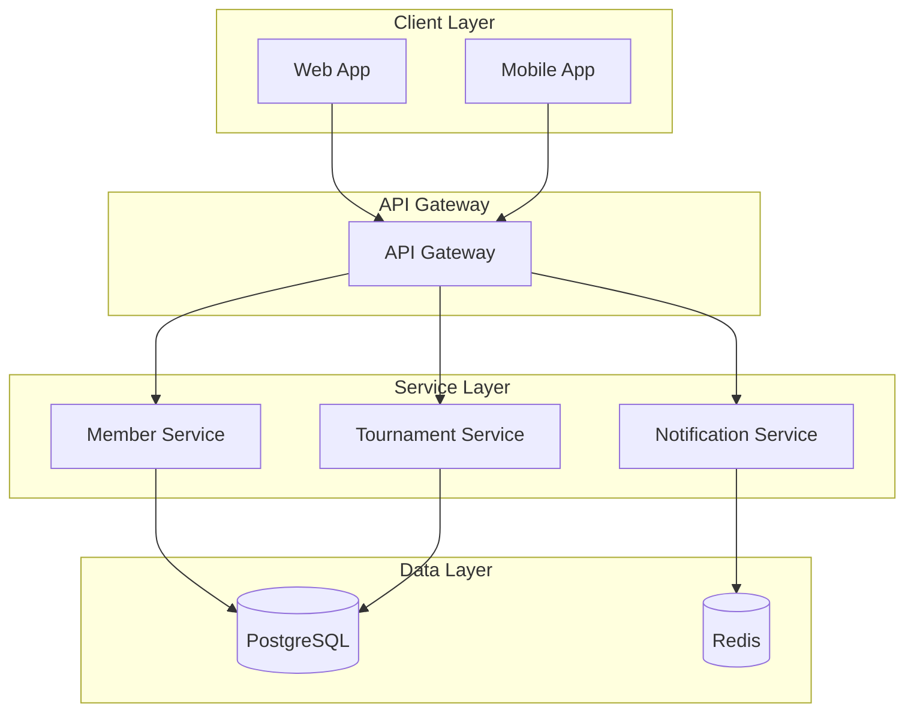

# Documentation Standards

---
guideline_type: "project-standards"
scope: "documentation-standards"
audience: ["developers", "ai-assistants", "technical-writers"]
last_updated: "2025-09-15"
dependencies: ["master-guideline.md"]
related_files: ["README*.md", "docs/**", "*.md", "openapi.yaml"]
ai_context: "Documentation language standards, README structure, API documentation, and technical writing guidelines"
---

## 📝 Dokumentationsstandards

### Sprache für Dokumentation

* **README-Dateien:** Alle README-Dokumentationen im Projekt müssen in **deutscher Sprache** verfasst werden. Dies gewährleistet Konsistenz und Zugänglichkeit für das deutsche Entwicklungsteam.

* **Code-Kommentare:** Komplexe Geschäftslogik und fachliche Zusammenhänge sollen in deutscher Sprache kommentiert werden.

* **API-Dokumentation:** OpenAPI-Beschreibungen und -Beispiele sind bevorzugt in deutscher Sprache zu verfassen, sofern keine internationalen Anforderungen bestehen.

> **🤖 AI-Assistant Hinweis:**
> Dokumentationssprache-Regeln:
> - **README-Dateien:** Immer Deutsch
> - **Code-Kommentare:** Deutsch für Geschäftslogik, Englisch für technische Details
> - **API-Docs:** Deutsch bevorzugt, Englisch bei internationalen APIs
> - **Technische Begriffe:** Englische Originalform wenn keine deutsche Übersetzung etabliert

### Dokumentationsstruktur

* README-Dateien sollen eine einheitliche Struktur befolgen: Überblick, Architektur, Entwicklung, Tests, Deployment.

* Technische Begriffe dürfen in englischer Originalform verwendet werden, wenn keine etablierte deutsche Übersetzung existiert.

## 🎯 AI-Assistenten: Documentation-Schnellreferenz

### README-Template-Struktur

```markdown
# [Projekt/Modul Name]

## Überblick
[Kurze Beschreibung des Zwecks und der Funktionalität]

## Architektur
[Architektonische Entscheidungen und Komponenten-Übersicht]

## Entwicklung
[Setup-Anweisungen für lokale Entwicklung]

### Voraussetzungen
[Erforderliche Tools und Versionen]

### Installation
[Schritt-für-Schritt Setup-Anleitung]

### Konfiguration
[Wichtige Konfigurationsoptionen]

## Tests
[Test-Ausführung und Test-Strategie]

## Deployment
[Deployment-Anweisungen für verschiedene Umgebungen]

## API-Dokumentation
[Links zu API-Docs oder eingebettete Dokumentation]

## Troubleshooting
[Häufige Probleme und Lösungen]
```

### Code-Kommentar-Standards

#### Deutsche Geschäftslogik-Kommentare
```kotlin
/**
 * Prüft, ob ein Mitglied für die Anmeldung zu einem Turnier berechtigt ist.
 *
 * Ein Mitglied ist berechtigt, wenn:
 * - Der Mitgliedsstatus AKTIV ist
 * - Die Lizenz gültig und nicht suspendiert ist
 * - Keine offenen Zahlungen vorliegen
 */
fun isEligibleForTournament(member: Member, tournament: Tournament): Result<Boolean, ValidationError> {
    // Mitgliedsstatus prüfen
    if (member.status != MemberStatus.ACTIVE) {
        return Result.Failure(ValidationError.MEMBER_NOT_ACTIVE)
    }

    // Lizenzvalidierung durchführen
    return validateLicense(member, tournament)
}
```

#### Englische technische Kommentare
```kotlin
/**
 * Cache implementation using Redis with TTL support
 * Performance: O(1) for get/set operations
 */
class RedisCache<T>(
    private val redisClient: RedisClient,
    private val ttl: Duration = Duration.ofHours(1)
) : Cache<T> {

    override suspend fun get(key: String): T? {
        // Use Redis GET command with automatic deserialization
        return redisClient.get(key)?.let {
            jsonMapper.readValue(it, typeRef<T>())
        }
    }
}
```

### OpenAPI-Dokumentation Standards

#### Deutsche API-Beschreibungen
```yaml
openapi: 3.0.0
info:
  title: Meldestelle API
  description: REST API für die Verwaltung von Pferdesport-Meldungen
  version: 1.0.0

paths:
  /members:
    post:
      summary: Neues Mitglied anlegen
      description: |
        Erstellt ein neues Mitglied in der Datenbank.
        Validiert alle Pflichtfelder und prüft auf Duplikate.
      requestBody:
        description: Mitgliedsdaten für die Erstellung
        required: true
        content:
          application/json:
            schema:
              $ref: '#/components/schemas/CreateMemberRequest'
            example:
              name: "Max Mustermann"
              email: "max.mustermann@example.com"
              licenseNumber: "12345"
      responses:
        '201':
          description: Mitglied erfolgreich erstellt
          content:
            application/json:
              schema:
                $ref: '#/components/schemas/Member'
        '400':
          description: Ungültige Eingabedaten
          content:
            application/json:
              schema:
                $ref: '#/components/schemas/ValidationError'

components:
  schemas:
    Member:
      type: object
      description: Repräsentiert ein Mitglied im System
      properties:
        id:
          type: string
          format: uuid
          description: Eindeutige Mitglieds-ID
          example: "550e8400-e29b-41d4-a716-446655440000"
        name:
          type: string
          description: Vollständiger Name des Mitglieds
          example: "Max Mustermann"
        email:
          type: string
          format: email
          description: E-Mail-Adresse des Mitglieds
          example: "max.mustermann@example.com"
```

### Dokumentations-Checkliste

#### README-Dateien
- [ ] **Struktur:** Folgt dem Standard-Template
- [ ] **Sprache:** Auf Deutsch verfasst
- [ ] **Aktualität:** Entspricht dem aktuellen Code-Stand
- [ ] **Vollständigkeit:** Alle erforderlichen Abschnitte vorhanden
- [ ] **Beispiele:** Konkrete Code-Beispiele und Kommandos
- [ ] **Links:** Funktionierende Verweise auf verwandte Dokumentation

#### API-Dokumentation
- [ ] **OpenAPI-Spezifikation:** Vollständig und valide
- [ ] **Deutsche Beschreibungen:** Für alle Endpunkte und Schemas
- [ ] **Beispiele:** Realistische Request/Response-Beispiele
- [ ] **Error-Handling:** Dokumentierte Fehlerfälle
- [ ] **Authentifizierung:** Sicherheitsanforderungen dokumentiert

#### Code-Kommentare
- [ ] **Geschäftslogik:** Deutsche Kommentare für fachliche Aspekte
- [ ] **Technische Details:** Englische Kommentare für Framework-/Library-Code
- [ ] **Komplexität:** Komplexe Algorithmen sind erklärt
- [ ] **TODOs:** Mit Ticket-Referenzen versehen
- [ ] **Javadoc/KDoc:** Für öffentliche APIs vollständig

### Dokumentations-Patterns

#### Architektur-Diagramme
```markdown
## System-Architektur


```

#### Feature-Dokumentation
```markdown
## Feature: Turnier-Anmeldung

### Fachlicher Überblick
Die Turnier-Anmeldung ermöglicht es Mitgliedern, sich für Turniere zu registrieren.

### User Stories
- Als Mitglied möchte ich mich für ein Turnier anmelden können
- Als Turnierleiter möchte ich Anmeldungen verwalten können

### Technische Umsetzung

#### API-Endpunkte
- `POST /tournaments/{id}/registrations` - Anmeldung erstellen
- `GET /tournaments/{id}/registrations` - Anmeldungen abrufen
- `DELETE /registrations/{id}` - Anmeldung stornieren

#### Domain-Events
- `TournamentRegistrationCreated` - Bei erfolgreicher Anmeldung
- `TournamentRegistrationCancelled` - Bei Stornierung

### Business Rules
1. Anmeldung nur für aktive Mitglieder möglich
2. Anmeldeschluss muss beachtet werden
3. Maximale Teilnehmerzahl darf nicht überschritten werden
```

#### Troubleshooting-Dokumentation
```markdown
## Häufige Probleme

### Problem: Service startet nicht
**Symptome:** Container bleibt im Status "Restarting"

**Ursachen:**
- Datenbankverbindung fehlgeschlagen
- Fehlende Environment-Variablen
- Port bereits belegt

**Lösung:**
1. Logs prüfen: `docker-compose logs service-name`
2. Environment-Variablen validieren
3. Port-Konflikte lösen: `netstat -tulpn | grep :8080`

### Problem: Langsame API-Antworten
**Symptome:** Response-Zeiten > 2 Sekunden

**Debugging:**
```bash
# Database-Performance prüfen
docker-compose exec postgres psql -c "SELECT * FROM pg_stat_activity;"

# Redis-Performance prüfen
docker-compose exec redis redis-cli info stats
```

**Optimierung:**
- Database-Indizes überprüfen
- Query-Performance analysieren
- Cache-Hit-Rate optimieren
```

### Versionierung und Updates

#### Dokumentations-Versionierung
- README-Dateien werden mit dem Code versioniert
- API-Dokumentation folgt Semantic Versioning
- Changelog wird für breaking changes geführt

#### Update-Prozess
1. **Code-Änderungen** → README aktualisieren
2. **API-Änderungen** → OpenAPI-Spec anpassen
3. **Architektur-Änderungen** → Diagramme überarbeiten
4. **Deployment-Änderungen** → Deployment-Docs aktualisieren

---

**Navigation:**
- [Master-Guideline](../master-guideline.md) - Übergeordnete Projektrichtlinien
- [Coding-Standards](./coding-standards.md) - Code-Qualitätsstandards
- [Testing-Standards](./testing-standards.md) - Test-Qualitätssicherung
- [Architecture-Principles](./architecture-principles.md) - Architektur-Grundsätze
