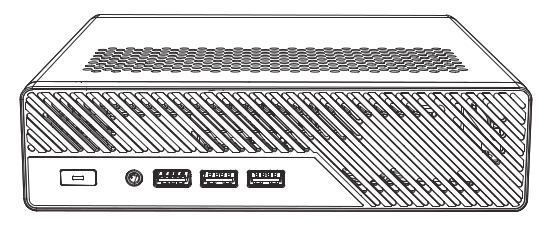
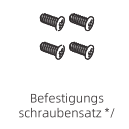
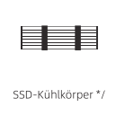
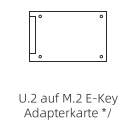
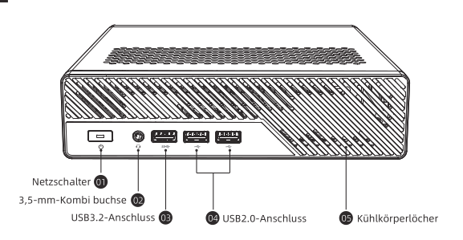
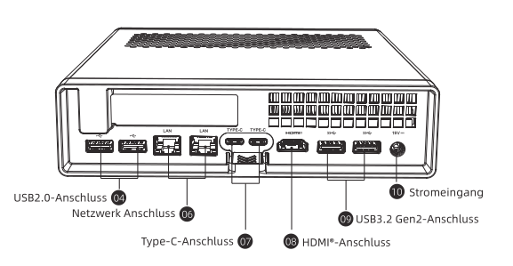

---
Betriebsanleitung Minisforum MS-R1
---

# MINISFORUM MS-R1




```
Copyright @ 2024-2025 Micro Computer (HK) Tech Limited.
```

---

## 1. Haftungsausschluss Und Sicherheitshinweise

### Haftungsausschluss

1. Vielen Dank, dass Sie sich für das Produkt MS-R1 entschieden haben.
2. Die in diesem Haftungsausschluss genannten Inhalte beziehen sich auf Ihre Sicherheit, Ihre
   gesetzlichen Rechte und Pflichten. Bitte beachten Sie alle Warn-, Vorsichts- und Aufmerksam-
   keitszeichen auf den Bedienungsanleitung und Produktetiketten und installieren Sie es gemäß
   den Bedienungsanleitung in der Anleitung.
3. Das Produkt ist relativ komplex und Benutzer müssen über grundlegende praktische
   Installationsfähigkeiten und Sicherheitskenntnisse verfügen. Bei der Installation sollten Sie
   vorsichtig sein.
4. Bevor Sie dieses Produkt verwenden, lesen Sie bitte die Bedienungsanleitung sorgfältig durch,
   um sicherzustellen, dass das Produkt korrekt eingerichtet werden kann. Die Nichtbeachtung von
   Anweisungen, Warnhinweisen, Vorsichtsmaßnahmen und Hinweisschildern kann zu
   Produktschäden, Datenverlusten. In schwerwiegenden Fällen kann es zu Personen- und
   Sachschäden kommen.
5. Wenn Sie dieses Produkt verwenden, wird davon ausgegangen, dass Sie den Hinweis-, Warn-,
   Vorsichts-und Aufmerksamkeitsschilder sorgfältig gelesen, verstanden und akzeptiert haben. Sie
   verpflichten sich, die volle Verantwortung für die Folgen der Verwendung dieses Produkts zu
   übernehmen. Sie verpflichten sich, dieses Produkt nur für rechtmäßige Zwecke zu verwenden und
   Sie stimmen den Bedingungen dieses Haftungsausschlusses und allen von MINISFORUM
   aufgestellten Grundsätzen und Richtlinien zu.
6. Zusätzlich zu den Garantiebedingungen haftet MINISFORUM nicht für Schäden oder Verletzun-
   gen, die sich direkt oder indirekt aus der Verwendung dieses Produkts ergeben, insbesondere für
   Schäden, die sich aus der Nichtbeachtung der Sicherheitsrichtlinien ergeben, und der Benutzer
   muss alle in dieser Erklärung und in der Bedienungsanleitung genannten Sicherheitsrichtlinien
   befolgen.
7. Das letzte Auslegungsrecht dieser Erklärung liegt beim MINISFORUM.

### Vorsichtsmaßnahmen

1. Staub, Feuchtigkeit und starke Temperaturschwankungen können die Lebensdauer dieses
   Produkts beeinträchtigen. Vermeiden Sie daher, das Produkt an diesen Orten aufzustellen.
2. Dieses Produkt sollte nur bei Temperaturen im Bereich von 0°C bis 35°C verwendet werden.
3. Die geeignete Temperatur für dieses Produkt und Zubehör beträgt 0°C bis 35°C.
4. Blockieren Sie nicht die Lüftungsöffnungen des Geräts. Halten Sie einen Abstand von
   mindestens 10 cm ein, um eine ausreichende Belüftung zu gewährleisten.
5. Verwenden Sie das mitgelieferte Netzteil. Netzteile anderer Hersteller können das Gerät
   beschädigen.
6. Wenn Sie ein Verlängerungskabel verwenden, stellen Sie sicher, dass die Gesamtstromstärke
   aller angeschlossenen Geräte die zulässige Stromstärke des Kabels nicht überschreitet.
7. Wenn das Produkt längere Zeit nicht verwendet wird, ziehen Sie bitte den Netzstecker.
8. Bitte verwenden Sie keine Lösungsmittel wie Verdünner, Alkohol oder andere chemische
   Lösungsmittel, um das Produkt zu reinigen. Verwenden Sie ein weiches Tuch, um das Produkt
   zu reinigen.
9. Wenn das Produkt nass wird, schalten Sie es sofort aus und ziehen Sie den Netzstecker.
   Wenden Sie sich an den Kundendienst.
10. Öffnen Sie das Gehäuse nicht, wenn das Gerät eingeschaltet ist. Es besteht die Gefahr eines
    Stromschlags.
11. Wenn Sie das Gerät öffnen müssen, ziehen Sie zuerst den Netzstecker.
12. Wenn Sie das Gerät entsorgen, beachten Sie bitte die örtlichen Vorschriften zur Entsorgung
    von Elektronikschrott.

---

## 2. Lieferumfang

| Bild | Name | Menge |
| :---: | :--- | :---: |
|  | MINISFORUM MS-R1 | 1 |
|  | Netzteil | 1 |
|  | HDMI Kabel | 1 |
|  | Befestigungsschraubensatz | 1 |
|  | Bedienungsanleitung | 1 |
|  | SSD Kühlkörper | 1 |
|  | U.2 zu M.2 Adapter | 1 |

---

## 3. Schnittstellen

### Vorderseite



1.  **Power Button:** Ein-/Ausschalter mit LED-Anzeige.
2.  **USB 3.2 Gen2 Type-A:** Schnelle Datenübertragung (bis zu 10 Gbit/s).
3.  **USB 2.0 Type-A:** Für Peripheriegeräte wie Maus und Tastatur.
4.  **3.5mm Audio Jack:** Kombinierter Kopfhörer-/Mikrofonanschluss.
5.  **USB4 / Type-C:** Unterstützt Daten, Video (DP Alt Mode) und Power Delivery (PD).

### Rückseite



1.  **DC 19V:** Stromanschluss für das mitgelieferte Netzteil.
2.  **2.5G LAN (RJ45):** Schnelle Netzwerkverbindung (Intel I226-V).
3.  **10G SFP+:** Hochgeschwindigkeits-Netzwerkanschluss (für Glasfaser oder DAC).
4.  **HDMI 2.1:** Videoausgang (bis zu 4K@144Hz / 8K@60Hz).
5.  **USB 3.2 Gen2 Type-A:** Weitere schnelle USB-Anschlüsse.
6.  **USB4 / Type-C:** Zweiter voll funktionsfähiger USB4-Port.

---

## 4. Installation

### SSD Installation

1.  Entfernen Sie die Schrauben an der Unterseite des Gehäuses.
2.  Heben Sie die Bodenplatte vorsichtig ab.
3.  Lokalisieren Sie den M.2 Slot.
4.  Setzen Sie die SSD im 30-Grad-Winkel ein.
5.  Drücken Sie die SSD vorsichtig nach unten und befestigen Sie sie mit der Schraube.
6.  Bringen Sie den Kühlkörper an (falls vorhanden).

### RAM Installation

1.  Lokalisieren Sie die SO-DIMM Slots.
2.  Setzen Sie das RAM-Modul im 30-Grad-Winkel ein.
3.  Drücken Sie das Modul nach unten, bis die seitlichen Klammern einrasten.

### Montage

Das Gerät kann liegend betrieben oder mit einer VESA-Halterung an der Rückseite eines Monitors befestigt werden.

---

## 5. BIOS Einstellungen

Um in das BIOS zu gelangen, drücken Sie beim Starten des Geräts wiederholt die **Entf**-Taste (Delete).

*   **Boot Priority:** Legen Sie hier fest, von welchem Laufwerk gestartet werden soll.
*   **Secure Boot:** Kann für bestimmte Betriebssysteme (z.B. Linux) deaktiviert werden müssen.
*   **Power On after Power Loss:** Einstellung, ob das Gerät nach einem Stromausfall automatisch starten soll (Wichtig für Server-Betrieb!).

---

## 6. Treiber und Support

Treiber und weitere Informationen finden Sie auf der offiziellen Support-Seite von Minisforum:
[https://www.minisforum.com/support](https://www.minisforum.com/support)

Bei Problemen wenden Sie sich bitte an den Support: `support@minisforum.com`
