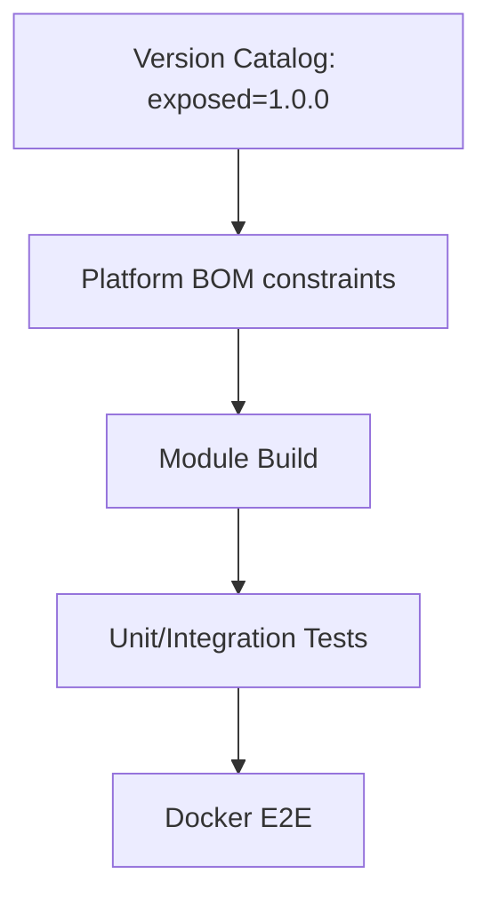

# Architektonische Evolution – Migrationsleitfaden: Exposed 1.0.0-rc-4 → 1.0.0

Dieses Dokument fasst die Auswirkungen und konkreten Migrationsschritte für das Update von JetBrains Exposed
von `1.0.0-rc-4` auf die stabile Version `1.0.0` zusammen. Ziel ist eine sichere, reproduzierbare Migration ohne
Regressionsrisiken und unter Wahrung unserer Architektur-Governance (API/Domain/Infrastructure-Trennung, zentrale
Versionierung über Platform/BOM).

## 1. Breaking Changes (relevant für uns)

### 1.1 Überarbeitung der UUID-Unterstützung (Kotlin Multiplatform)

Aufgrund der Einführung der nativen `kotlin.uuid.Uuid` mussten bestehende Klassen, die auf `java.util.UUID` basieren,
verschoben werden, um Namenskollisionen zu vermeiden.

* **Paket-Migration:** Bestehende UUID-Klassen wurden in ein `.java`-Subpaket verschoben:

* `org.jetbrains.exposed.v1.core.dao.id.UUIDTable` -> `...id.java.UUIDTable`

* `org.jetbrains.exposed.v1.core.UUIDColumnType` -> `...core.java.UUIDColumnType`

* `org.jetbrains.exposed.v1.dao.UUIDEntity` -> `...dao.java.UUIDEntity`

* **Methoden-Änderung:** Die Standardmethode `Table.uuid()` akzeptiert nun ausschließlich `kotlin.uuid.Uuid`.

* **Migrationspfad:** Für die Weiterverwendung von `java.util.UUID` muss stattdessen die neue Extension-Funktion
  `Table.javaUUID()` genutzt werden.

### 1.2 Refactoring des Transaction Managers

Die Typisierung der Transaction Manager wurde spezifiziert, um besser zwischen JDBC und R2DBC zu unterscheiden.

* **Spezifische Rückgabetypen:** `Database.transactionManager` und `R2dbcDatabase.transactionManager` geben nun
  Instanzen von `JdbcTransactionManager` bzw. `R2dbcTransactionManager` zurück (statt des generischen
  `TransactionManager`).

* **Entfernung von APIs:** Die Methode `TransactionManagerApi.currentOrNull()` wurde entfernt.

* **Ersatz:** Nutzen Sie stattdessen die Extension-Funktionen `JdbcTransactionManager.currentOrNull()` /
  `R2dbcTransactionManager.currentOrNull()` oder die statische Methode `TransactionManager.currentOrNull()`.

### 1.3 R2DBC API Bereinigungen

Um die API näher an die zugrunde liegenden Treiber-Spezifikationen (io.r2dbc.spi) zu bringen, wurden ungenutzte Methoden
entfernt.

* **R2dbcPreparedStatementApi:** Die Methoden `closeIfPossible()` und `cancel()` wurden entfernt, da sie in der
  R2DBC-Spi keine Entsprechung finden.

* **Methoden-Umbenennung:** `R2dbcTransaction.closeExecutedStatements()` wurde in `.clearExecutedStatements()`
  umbenannt. Diese Methode ist nun nicht mehr suspendierbar (`non-suspending`).

### 1.4 SQLite & JSONB Automatisierung

Das Handling von JSONB-Spalten in SQLite wurde vereinheitlicht.

* **Automatisches Wrapping:** Bei der Verwendung von `jsonb()` werden Spalten in der `SELECT`-Klausel nun automatisch in
  die SQL-Funktion `JSON()` eingepackt, um die Lesbarkeit zu verbessern.

* **Konfiguration:** Dieses Verhalten kann über den Parameter `castToJsonFormat=false` deaktiviert werden.

* **Core-Interface:** Das Interface `JsonColumnMarker` in `exposed-core` wurde um die Eigenschaft
  `needsBinaryFormatCast` erweitert.

### 1.5 Sonstige Anpassungen

* **Logging-Level:** Die Protokollierung für Transaction-Retry-Verzögerungen und Rollback-Fehler wurde von `WARN` auf
  `DEBUG` herabgestuft.

* **Transaktions-ID:** Das Feld `Transaction.id` wurde endgültig in `Transaction.transactionId` umbenannt, um
  Shadowing-Probleme mit Benutzer-Code zu vermeiden.

---

## 2. Migrationsschritte (How-To)

1. Zentralversion heben:
   - `gradle/libs.versions.toml`: `exposed = "1.0.0"` setzen.
   - Platform-BOM importieren; keine Direktversionen in Modul-Builds.
2. UUID-Pfade prüfen:
   - Nutzung von `Table.uuid()` evaluieren; falls `java.util.UUID` benötigt, auf `Table.javaUUID()` wechseln.
   - Etwaige Referenzen auf verschobene `.UUID*`-Typen auf das neue `.java`-Subpaket anpassen.
3. TransactionManager-Aufrufe:
   - Verwendungen von `TransactionManagerApi.currentOrNull()` entfernen.
   - Stattdessen `JdbcTransactionManager.currentOrNull()` bzw. `TransactionManager.currentOrNull()` einsetzen.
4. R2DBC (falls verwendet):
   - Entfernte Methoden (`closeIfPossible`, `cancel`) nicht mehr aufrufen.
   - Umbenennung auf `.clearExecutedStatements()` berücksichtigen (non-suspending).
5. JSON/SQLite:
   - Verhalten von `jsonb()` mit `castToJsonFormat` prüfen und ggf. deaktivieren.

## 3. Test-Matrix

- Unit: DSL-Typen (UUID, Zeittypen), Mappings, einfache Inserts/Selects.
- Integration: JDBC/Hikari Konfiguration, `batchInsert`, Upsert/Ignore-Pfade.
- E2E (Docker): CRUD-Flows über den Service hinweg; Metriken/Health.

## 4. Rollback-Plan

- `git revert` des Version-Bumps in `libs.versions.toml` und ggf. betroffener Anpassungs-Commits.
- Rebuild; E2E-Smoketest durchführen.
- Dokumentenstatus auf `ARCHIVED` setzen oder Nachtrag mit „Rollback erfolgt“ ergänzen.

## 5. Diagramm (Flow)

