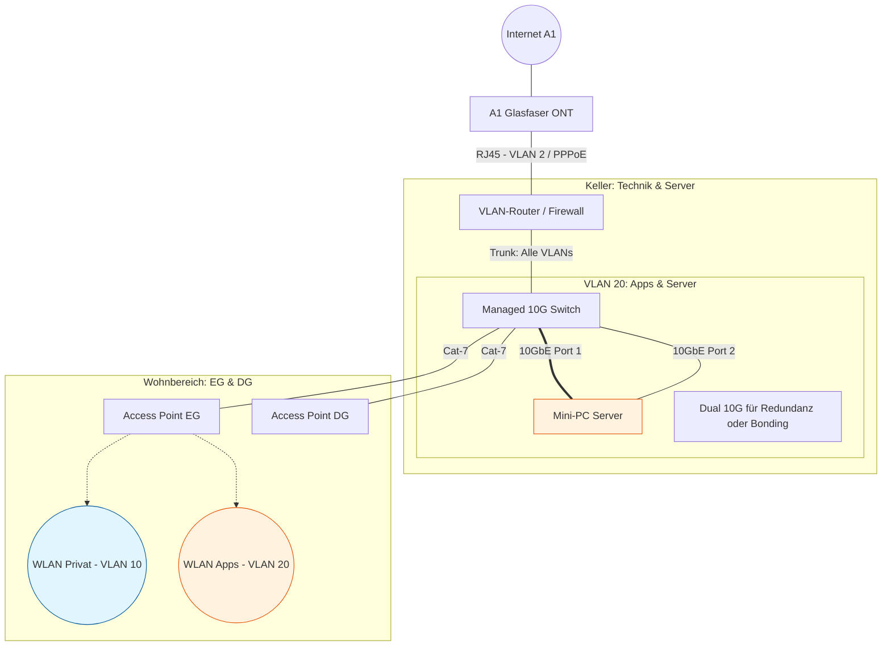

#  Heimnetzwerk

```mermaid
graph TD
%% Internet & Modem
  WAN((Internet A1)) --- ONT[A1 Glasfaser ONT]
  ONT ---|RJ45 - VLAN 2 / PPPoE| Router[VLAN-Router / Firewall]

  subgraph Keller [Keller: Technik & Server]
    Router ---|Trunk: Alle VLANs| Switch[Managed 10G Switch]

    subgraph ServerZone [VLAN 20: Apps & Server]
      Switch ===|10GbE Port 1| MiniPC[Mini-PC Server]
      Switch ---|10GbE Port 2| MiniPC
      note1[Dual 10G für Redundanz oder Bonding]
    end
  end

  subgraph Etagen [Wohnbereich: EG & DG]
    Switch ---|Cat-7| AP_EG[Access Point EG]
    Switch ---|Cat-7| AP_DG[Access Point DG]

    AP_EG -.-> SSID_P((WLAN Privat - VLAN 10))
    AP_EG -.-> SSID_A((WLAN Apps - VLAN 20))
  end

%% Definition der VLANs
  classDef vlan10 fill:#e1f5fe,stroke:#01579b
  classDef vlan20 fill:#fff3e0,stroke:#e65100
  class MiniPC,SSID_A vlan20
  class SSID_P vlan10
```

